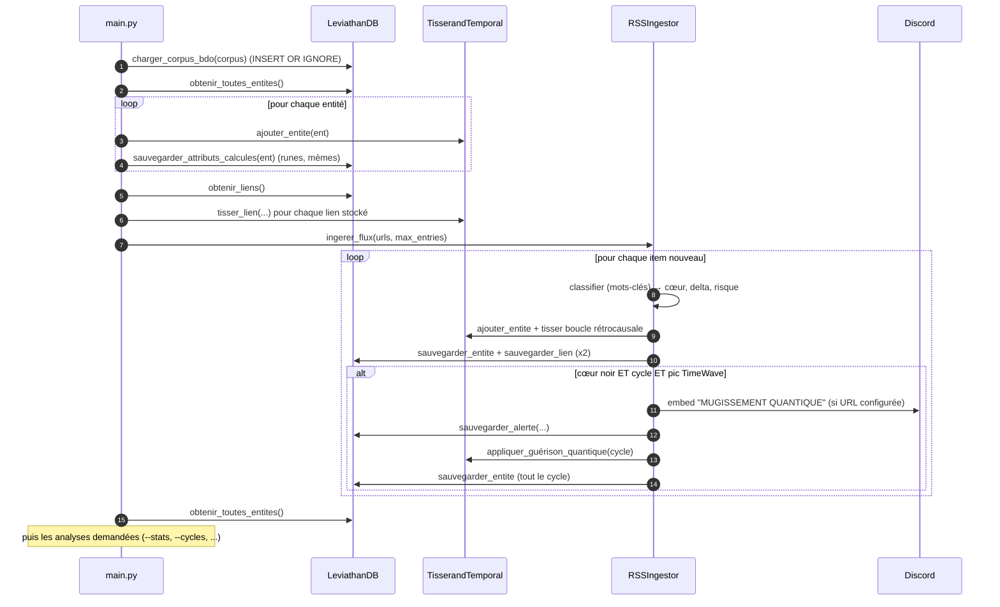

# 🌀 CHRONOS-TRAME : Le Léviathan Ontique

> *"Le temps n'est pas une ligne, c'est une toile d'araignée dont nous sommes à la fois la mouche et l'architecte."* — Codex MTT-2075

Une chimère logicielle fusionnant la détection de signaux faibles, la taxonomie des anomalies, la topologie des paradoxes temporels et la courbe de nouveauté fractale. Le Léviathan peut désormais **digérer des flux RSS**, tisser ses propres paradoxes et **alerter un salon Discord** lorsqu'un Mugissement Quantique se produit.

Ce document est à la fois **la référence technique** du dépôt (architecture, modèle de données, API de chaque module) et **un tutoriel pas à pas** (installer, lancer, étendre). Les chiffres et sorties donnés ont été **exécutés sur Python 3.12** ; les rares points non vérifiés (flux web réels, webhook Discord réel, GUI) sont signalés comme tels.

---

## Table des matières

1. [Nature du projet et état d'implémentation](#1-nature-du-projet-et-état-dimplémentation)
2. [Prérequis et installation](#2-prérequis-et-installation)
3. [Démarrage rapide](#3-démarrage-rapide)
4. [Arborescence du dépôt](#4-arborescence-du-dépôt)
5. [Architecture et flux de données](#5-architecture-et-flux-de-données)
6. [Glossaire du domaine](#6-glossaire-du-domaine)
7. [Modèle de données](#7-modèle-de-données)
8. [Référence des modules](#8-référence-des-modules)
9. [Tutoriels pas à pas](#9-tutoriels-pas-à-pas)
10. [Limites connues et pièges](#10-limites-connues-et-pièges)
11. [Dépannage](#11-dépannage)
12. [Vérifier l'installation (smoke test)](#12-vérifier-linstallation-smoke-test)
13. [Pistes d'évolution](#13-pistes-dévolution)

---

## 1. Nature du projet et état d'implémentation

Chronos-Trame est un projet **expérimental et créatif** (~1 300 lignes de Python) : il emprunte son vocabulaire à la fiction spéculative et à la théorie du *Timewave Zero* (Terence McKenna), et l'implémente sous forme de **modèle stylisé**. La table de nouveauté est une approximation simplifiée (voir §8.4) : elle produit un signal reproductible, pas une prédiction.

### Les 4 piliers

| # | Pilier | Rôle | Module |
|---|--------|------|--------|
| 1 | **Trame** | Détection de signaux, traduction en *FracturoScript* (runes) et repérage de *mèmes* | `core/fracturo_engine.py`, `core/rss_ingestor.py` |
| 2 | **BDO** | Classification ontique (Cœurs Noir/Gris/Blanc, Delta) | `core/ontology.py`, `storage/leviathan_db.py` |
| 3 | **TemporalNetwork** | Détection des cycles rétrocausaux (paradoxes) | `core/temporal_graph.py` |
| 4 | **TimeWave Zero** | Courbe de nouveauté et superposition des événements | `core/timewave.py` |

### Le « Mugissement Quantique »

Si un signal de cœur **Noir** crée un cycle dans le graphe (**Paradoxe**) lors d'un **pic de nouveauté** (TimeWave), le système émet une alerte critique. Deux chemins y mènent :

- **À l'ingestion** (`--ingerer`) : chaque nouvel item RSS est testé au moment où il est digéré. L'alerte est affichée, **envoyée à Discord** (si configuré), **enregistrée en base** (table `alertes`), puis la « guérison quantique » corrompt le cycle.
- **En analyse** (`--mugissements`) : relecture de tout le graphe stocké, sans effet de bord.

### État réel des fonctionnalités

| Fonctionnalité | État | Détail |
|---|---|---|
| Chargement du corpus JSON → SQLite | ✅ | Idempotent (`INSERT OR IGNORE`) |
| Runes, mèmes | ✅ | Calculés et **persistés** (colonnes `runes`, `paleo_memes`) |
| Liens temporels | ✅ | Table `liens_temporels` lue au démarrage, écrite par l'ingestion |
| Détection de cycles (paradoxes) | ✅ | `nx.simple_cycles` |
| Courbe TimeWave, pics de nouveauté | ✅ | Modèle simplifié |
| CLI d'analyse (`stats`, `cycles`, `signaux`, `timewave`, `mugissements`) | ✅ | `main.py`, avec filtres |
| Exports PNG/SVG/PDF/JPG + rapport JSON | ✅ | Sans écran (backend `Agg`) |
| `config.json` | ✅ | Lu par `main.py` (créé avec des valeurs par défaut s'il manque) |
| **Ingestion RSS** | ✅ 🆕 | `core/rss_ingestor.py` ; **non testée sur des flux web réels** par l'auteur de cette doc (testée sur flux local) |
| **Alerte Discord** | ✅ 🆕 | `core/webhook_notifier.py` ; envoi réel **non vérifié** (échec réseau et mode silencieux vérifiés) |
| Dashboard GUI (graphe + courbe) | ✅ | Nécessite `tkinter` et un écran ; non relancé pour cette mise à jour |
| `ui/cli_oracle.py` (`simuler_veille_trame`) | 🟡 Legacy | Démo à signaux codés en dur ; **n'est plus appelée par `main.py`** |
| `generer_prophetie` | 🟡 | Disponible, jamais appelée |

---

## 2. Prérequis et installation

### Prérequis

- **Python 3.8+** (testé avec 3.12.3).
- **tkinter** pour le mode GUI uniquement (souvent packagé à part sous Linux).
- Un terminal **UTF-8** (runes, emojis et tableaux `rich` utilisent Unicode).
- Un accès réseau pour l'ingestion RSS et les alertes Discord (l'analyse locale n'en a pas besoin).

### Installation pas à pas

```bash
# 1. Récupérer le dépôt (ou décompresser l'archive)
unzip Chronos-Trame-Discordia-main-v2.zip && cd Chronos-Trame-Discordia-main

# 2. Créer un environnement virtuel (recommandé)
python3 -m venv .venv
source .venv/bin/activate          # Windows PowerShell : .venv\Scripts\Activate.ps1

# 3. Installer les dépendances
pip install -r requirements.txt
```

| Paquet | Usage réel dans le code |
|---|---|
| `rich` | Tableaux, panneaux et couleurs de la console (`main.py`, `core/rss_ingestor.py`) |
| `networkx` | Graphe orienté et détection de cycles ; dessin du graphe |
| `matplotlib` | Dashboard GUI (backend `TkAgg`) et exports d'images (backend `Agg`) |
| `numpy` | Sinusoïde et percentile de la courbe TimeWave |
| `feedparser` | 🆕 Lecture des flux RSS/Atom (`core/rss_ingestor.py`) |

Le webhook Discord n'ajoute **aucune dépendance** : il utilise `urllib` de la bibliothèque standard. Aucune version n'est épinglée : pour un environnement reproductible, faites un `pip freeze > requirements.lock`.

### Installer tkinter (GUI uniquement)

| Système | Commande |
|---|---|
| Debian / Ubuntu | `sudo apt install python3-tk` |
| Fedora | `sudo dnf install python3-tkinter` |
| macOS (Homebrew) | `brew install python-tk` |
| Windows | Inclus avec l'installeur python.org (case « tcl/tk and IDLE ») |

```bash
python3 -c "import tkinter; print('tkinter OK')"
```

---

## 3. Démarrage rapide

**Toujours lancer depuis la racine du dépôt** : tous les chemins (`leviathan.db`, `data/…`) sont relatifs au répertoire courant (§10).

```bash
python main.py --mode cli                 # Analyse par défaut : statistiques + Mugissements
python main.py --mode gui                 # Tableau de bord visuel (défaut si --mode omis)
python main.py --ingerer                  # 🆕 Digère les flux RSS de data/config.json
```

### Toutes les options de `main.py`

| Catégorie | Option | Effet |
|---|---|---|
| Interface | `--mode {cli,gui}` | Interface à utiliser (défaut : `gui`) |
| Config | `--config` | Affiche la configuration actuelle puis quitte |
| | `--set-zero-date YYYY-MM-DD` | Change la date zéro de la TimeWave (persistée dans `config.json`) |
| Filtres | `--coeur {noir,gris,blanc}` | Filtre par cœur |
| | `--classe X` | Filtre par classe (`RM`, `IR`, `ESC`…) |
| | `--risque-min N` | Risque minimum |
| | `--date-debut` / `--date-fin` | Bornes `YYYY-MM-DD` sur `date_debut` |
| Analyses | `--stats` | Répartition par cœur et classe, taille du graphe |
| | `--cycles` | Liste détaillée des cycles (paradoxes) |
| | `--signaux` | Score de « signal faible » par entité |
| | `--timewave` | Top pics/creux et statistiques de la courbe |
| | `--mugissements` | Détection des Mugissements Quantiques |
| Paramètres | `--seuil-delta F` | Seuil de delta des signaux faibles (défaut `0.7`) |
| | `--seuil-pic N` | ⚠️ Accepté mais **sans effet** (le percentile 90 est fixe, §10) |
| | `--annee-debut` / `--annee-fin` | Fenêtre de la courbe (défaut `1950` → `2032`) |
| | `--top-n N` | Nombre de lignes des classements (défaut `10`) |
| Exports | `--export-graphe PATH` | Graphe des paradoxes (`png`, `svg`, `pdf`, `jpg`, selon l'extension) |
| | `--export-timewave PATH` | Courbe de nouveauté |
| | `--export-rapport PATH` | Rapport JSON complet |
| | `--theme {dark,light}` | Thème des exports (défaut `dark`) |
| **Ingestion** 🆕 | `--ingerer` | Ingère les flux RSS puis poursuit les analyses demandées (**force le mode CLI**) |
| | `--flux URL` | Flux à ingérer (**répétable**) ; remplace `rss_feeds` ; accepte aussi un chemin de fichier local |
| | `--max-entries N` | Entrées max par flux (défaut : `rss_max_entries`) |

Sans aucune option d'analyse, le mode CLI exécute `--stats` et `--mugissements`. Avec `--ingerer` seul, seul le résumé de digestion est affiché.

```bash
python main.py --mode cli --stats --cycles
python main.py --mode cli --coeur noir --risque-min 4 --signaux
python main.py --mode cli --export-graphe graphe.png --export-timewave tw.svg --theme light
python main.py --ingerer --flux https://exemple.org/rss --max-entries 5 --cycles
```

### Ce que vous verrez en mode GUI

Une fenêtre 1200×800 à thème sombre avec **deux onglets** :

1. **🕸️ Graphe des Âges (Paradoxes)** : graphe orienté des entités, étiquetées par leur **nom**. Nœud rouge = cœur *noir*, blanc = *blanc*, gris = autre. Les arêtes d'un cycle sont surlignées en cyan.
2. **🌊 Onde de Nouveauté (TimeWave Zero)** : courbe de 1950 à ~2032 avec un point par entité (**20 au maximum**).

Le graphe reflète les liens stockés en base : avec le seul corpus d'exemple (une entité, aucun lien), il n'affiche **aucun paradoxe**. Le GUI n'ingère pas de flux : lancez d'abord `--ingerer`, puis `--mode gui`.

### Premier lancement : ce qui se passe sur le disque

`main.py` crée `leviathan.db` (SQLite) **dans le répertoire courant**, y insère le corpus, calcule et enregistre les runes/mèmes, puis réutilise la base aux lancements suivants. Ajoutez-la à votre `.gitignore` :

```bash
echo "leviathan.db" >> .gitignore
```

---

## 4. Arborescence du dépôt

```text
Chronos-Trame-Discordia-main/
├── main.py                    # 584 l. Point d'entrée : config, filtres, analyses, exports, ingestion
├── requirements.txt           # rich, networkx, matplotlib, numpy, feedparser (non épinglées)
├── README.md
├── core/                      # Logique métier
│   ├── __init__.py            #   (vide)
│   ├── ontology.py            #  36 l. Dataclass EntiteOntique : le modèle central
│   ├── fracturo_engine.py     #  47 l. Runes, mèmes, génération de prophéties
│   ├── temporal_graph.py      #  32 l. Graphe orienté, détection de paradoxes, "guérison"
│   ├── timewave.py            #  36 l. Courbe de nouveauté (TimeWave simplifié)
│   ├── rss_ingestor.py        # 207 l. 🆕 RSS → EntiteOntique, tissage rétrocausal, Mugissement
│   └── webhook_notifier.py    #  74 l. 🆕 Alerte Omega → webhook Discord (silencieux si non configuré)
├── storage/
│   ├── __init__.py            #   (vide)
│   └── leviathan_db.py        # 149 l. Persistance SQLite : entités, liens, alertes, import du corpus
├── ui/
│   ├── __init__.py            #   (vide)
│   ├── cli_oracle.py          #  52 l. Démo terminal legacy (non appelée par main.py)
│   └── gui_dashboard.py       # 104 l. Dashboard tkinter + matplotlib
└── data/
    ├── bdo_corpus_sample.json # 1 entité d'exemple (corpus chargé par défaut)
    ├── BDO2.json              # 1,6 Mo, 1 183 entrées : corpus BDO complet (à activer via corpus_path)
    └── config.json            # db_path, corpus_path, date zéro, webhook Discord, flux RSS
```

**Convention de nommage :** identifiants, docstrings et commentaires en **français** ; noms de méthodes en `snake_case` (y compris avec accent : `appliquer_guérison_quantique`).

---

## 5. Architecture et flux de données

### Dépendances entre modules

```mermaid
flowchart TD
    main["main.py<br/>(orchestrateur)"]

    subgraph core["core/"]
        onto["ontology.py<br/>EntiteOntique"]
        fract["fracturo_engine.py<br/>FracturoEngine"]
        graph["temporal_graph.py<br/>TisserandTemporal"]
        tw["timewave.py<br/>TimeWaveZero"]
        rss["rss_ingestor.py<br/>RSSIngestor"]
        hook["webhook_notifier.py<br/>DiscordNotifier"]
    end

    subgraph storage["storage/"]
        db["leviathan_db.py<br/>LeviathanDB"]
    end

    gui["ui/gui_dashboard.py<br/>DashboardLeviathan"]

    corpus[("bdo_corpus_sample.json<br/>BDO2.json")]
    sqlite[("leviathan.db")]
    feeds(("Flux RSS"))
    discord(("Discord"))

    main --> db
    main --> fract
    main --> graph
    main --> tw
    main --> rss
    main --> gui

    rss --> db
    rss --> fract
    rss --> graph
    rss --> tw
    rss --> hook

    fract --> onto
    graph --> onto
    db --> onto

    corpus -->|"charger_corpus_bdo()"| db
    db <--> sqlite
    feeds -->|"feedparser"| rss
    hook -->|"HTTP POST"| discord

    gui -.->|"duck typing"| db
    gui -.-> graph
    gui -.-> tw
```

`ontology.py` est le **socle** : `fracturo_engine`, `temporal_graph` et `leviathan_db` importent tous `EntiteOntique`. `rss_ingestor` est le seul module qui orchestre tous les moteurs ; il est importé **à la demande** (seulement avec `--ingerer`), donc `feedparser` n'est requis que pour l'ingestion. Le GUI reçoit ses moteurs en paramètres (injection de dépendances).

### Séquence d'une exécution `main.py --ingerer`



---

## 6. Glossaire du domaine

| Terme | Signification dans le code |
|---|---|
| **Trame** | Le tissu narratif/temporel global ; aussi le nom du pilier de détection de signaux. |
| **BDO** | Base de données d'anomalies (« ontiques ») dont provient le corpus JSON. Le sigle n'est pas développé dans le dépôt. |
| **Entité ontique** | Un événement/anomalie (corpus ou item RSS), représenté par `EntiteOntique`. |
| **Classe principale** | Catégorie de taxonomie : `RM`, `IR`, `ESC`, `VMO`, `Omega`… `NC` = non classé. Les items RSS reçoivent `IR` (Information Réfractaire). |
| **Cœur dominant** | Polarité : `"noir"`, `"gris"`, `"blanc"` ou `"NC"`. Pilote les couleurs, la détection de Mugissement et la « guérison ». |
| **Delta** | Amplitude d'une anomalie, en `[0, 1]`. Trois phases : `avant`, `pendant`, `apres`. |
| **Risque** | Entier de 1 à 5. |
| **Couches OSI** | `couches_osi: List[int]`, issu du champ `couches_affectees` du corpus ; stocké mais non exploité par la logique. |
| **FracturoScript** | Transcription d'un texte en runes (Futhark) : `traduire_en_runes`. |
| **Paléo-mème** | Mot déclencheur (`oubli`, `boucle`, `effondrement`, `lumière`, `ombre`, `machine`) associé à une séquence de runes. |
| **Paradoxe** | Un **cycle** dans le graphe orienté (y compris une auto-boucle). |
| **Lien causal / rétrocausal** | Arête passé→futur / futur→passé (attribut `type`). Seul le *cycle* compte pour la détection. |
| **Tissage rétrocausal** 🆕 | Règle d'ingestion : le nouvel item est relié à une entité plus ancienne (§8.6). |
| **Guérison quantique** | Delta ÷ 2 (plancher `0.05`) et cœur forcé à `noir` pour les entités d'un cycle. |
| **Nouveauté** | Valeur de la courbe TimeWave à une date donnée. |
| **Pic de nouveauté** | Valeur ≥ percentile 90 d'un historique fourni. |
| **Mugissement Quantique** | Alerte critique : cœur noir + cycle + pic de nouveauté. |
| **Alerte Omega** 🆕 | Le message du Mugissement envoyé à Discord et stocké dans la table `alertes`. |
| **Signal faible** | Entité dont le score (pic +3, noir +2, delta ≥ seuil +2, risque ≥ 4 +1) atteint 3 (`--signaux`). |
| **Léviathan / Tisserand** | Noms de fantaisie : `LeviathanDB` (base), `TisserandTemporal` (graphe), `DashboardLeviathan` (GUI). |

---

## 7. Modèle de données

### 7.1 `EntiteOntique` (`core/ontology.py`)

Dataclass (mutable). Les 11 premiers champs sont **obligatoires** ; les suivants ont une valeur par défaut.

| Champ | Type | Défaut | Rôle |
|---|---|---|---|
| `id` | `str` | requis | Identifiant unique (nœud du graphe, clé primaire SQL) |
| `nom` | `str` | requis | Libellé affiché |
| `description` | `str` | requis | Texte analysé pour les mèmes (200 caractères max en base) |
| `date_debut` | `str` | requis | Date ISO `YYYY-MM-DD` |
| `date_fin` | `Optional[str]` | requis | Date de fin (`None` pour les items RSS) |
| `classe_principale` | `str` | requis | `RM`, `IR`, `ESC`, `VMO`, `Omega`, `NC`… |
| `coeur_dominant` | `str` | requis | `noir` / `gris` / `blanc` / `NC` |
| `delta_avant` | `float` | requis | Delta avant l'événement |
| `delta_pendant` | `float` | requis | Delta pendant (celui que modifie la « guérison ») |
| `delta_apres` | `float` | requis | Delta après |
| `risque` | `int` | requis | 1 à 5 |
| `couches_osi` | `List[int]` | `[]` | Couches affectées (corpus) ; non exploité |
| `fragments_runiques` | `List[str]` | `[]` | Runes du nom, recalculées au démarrage et persistées |
| `paleo_memes` | `List[str]` | `[]` | Mèmes détectés, recalculés au démarrage et persistés |
| `superposition_active` | `bool` | `False` | Non exploité (non persisté) |
| `intention_observateur` | `float` | `0.5` | `0.0` (Noir) → `1.0` (Blanc) ; non exploité (non persisté) |

Membres utiles : `delta_moyen` (propriété, moyenne des trois deltas) et `to_dict()`.

### 7.2 Format du corpus JSON

Le fichier est une **liste** d'objets. Exemple minimal (`data/bdo_corpus_sample.json`) :

```json
[
  {
    "id": "demo_001",
    "nom": "Synchronicité de Vauville",
    "description": "Alignement runique spontané",
    "date_debut": "1999-12-31",
    "taxonomie": {"classe_principale": "ESC"},
    "coeur_dominant": "gris",
    "delta_estime": {"pendant": 0.4},
    "risque": 2
  }
]
```

`data/BDO2.json` suit le même schéma, enrichi de champs que l'importeur **ignore** (`lieu`, `statut`, `preuves`, `interpretation_mtt`, `sous_categories`…). Ses `delta_estime` contiennent `avant`, `pendant` et `apres`. Pour l'utiliser : mettre `"corpus_path": "data/BDO2.json"` dans `config.json` (et, de préférence, un autre `db_path`). Voir §10 pour ses particularités.

### 7.3 Correspondance JSON → SQLite → objet

Tous les champs sont **facultatifs** dans le JSON : `charger_corpus_bdo` applique des valeurs par défaut.

| Clé JSON | Colonne SQL | Défaut si absent | Champ `EntiteOntique` |
|---|---|---|---|
| `id` | `id` (PK) | `"unknown"` | `id` |
| `nom` | `nom` | `"Inconnu"` | `nom` |
| `description` | `description` | `""` — **tronquée à 200 caractères** | `description` |
| `date_debut` | `date_debut` | `"1970-01-01"` | `date_debut` |
| `date_fin` | `date_fin` | `NULL` | `date_fin` |
| `taxonomie.classe_principale` | `classe` | `"NC"` | `classe_principale` |
| `coeur_dominant` | `coeur` | `"gris"` | `coeur_dominant` |
| `delta_estime.avant` | `delta_avant` | `0.5` | `delta_avant` |
| `delta_estime.pendant` | `delta_pendant` | `0.5` | `delta_pendant` |
| `delta_estime.apres` | `delta_apres` | `0.5` | `delta_apres` |
| `risque` | `risque` | `1` | `risque` |
| *(calculé)* | `runes` | `""` | `fragments_runiques` |
| *(calculé)* | `paleo_memes` | `""` | `paleo_memes` |
| *(aucune)* | `couches` | `""` | `couches_osi` |

> **Attention.** Le défaut de `date_debut` ne s'applique que si la **clé est absente** ; une valeur `null` explicite est stockée telle quelle (§10). Deux entrées de même `id` : la seconde est ignorée. `couches_affectees` du JSON n'est **pas** importé (la colonne `couches` reste vide à l'import).

### 7.4 Schéma SQLite (`leviathan.db`)

```sql
CREATE TABLE entites (
    id TEXT PRIMARY KEY, nom TEXT, description TEXT, date_debut TEXT, date_fin TEXT,
    classe TEXT, coeur TEXT, delta_avant REAL, delta_pendant REAL, delta_apres REAL,
    risque INTEGER, runes TEXT, paleo_memes TEXT, couches TEXT
);

CREATE TABLE liens_temporels (
    source TEXT, cible TEXT, force REAL, type TEXT,
    PRIMARY KEY (source, cible, type)
);

CREATE TABLE alertes (            -- 🆕 journal des Mugissements
    id INTEGER PRIMARY KEY AUTOINCREMENT,
    entite_id TEXT, type TEXT, message TEXT, timestamp TEXT
);
```

Les bases créées par d'anciennes versions sont migrées automatiquement (`ALTER TABLE … ADD COLUMN`) ; la table `alertes` est créée si elle manque.

```bash
sqlite3 leviathan.db "SELECT id, nom, coeur, delta_pendant FROM entites ORDER BY date_debut DESC LIMIT 10;"
sqlite3 leviathan.db "SELECT timestamp, entite_id, type FROM alertes;"
# sans le binaire sqlite3 :
python3 -c "import sqlite3; print(sqlite3.connect('leviathan.db').execute('SELECT * FROM alertes').fetchall())"
```

### 7.5 `data/config.json`

```json
{
  "db_path": "leviathan.db",
  "corpus_path": "data/bdo_corpus_sample.json",
  "timewave_zero_date": "2012-12-21",
  "discord_webhook_url": "",
  "rss_feeds": [
    "https://www.science-et-vie.com/rss",
    "https://www.futura-sciences.com/rss/actualites.xml"
  ],
  "rss_max_entries": 10
}
```

| Clé | Rôle |
|---|---|
| `db_path` | Fichier SQLite |
| `corpus_path` | Corpus JSON chargé au démarrage |
| `timewave_zero_date` | Date zéro (modifiable via `--set-zero-date`) |
| `discord_webhook_url` | URL du webhook Discord ; vide = pas de notification |
| `rss_feeds` | Flux lus par `--ingerer` (remplacés par `--flux`) |
| `rss_max_entries` | Entrées max par flux |

Le fichier est créé avec ces valeurs s'il n'existe pas, et fusionné avec elles sinon (une clé absente reprend sa valeur par défaut). ⚠️ **Sécurité** : l'URL d'un webhook Discord est un secret. Évitez de la committer : laissez `discord_webhook_url` vide et utilisez la variable d'environnement `CHRONOS_TRAME_WEBHOOK_URL` (§9, Tuto 7). Attention aussi : `--set-zero-date` réécrit tout `config.json`, URL comprise.

---

## 8. Référence des modules

### 8.1 `core/ontology.py`

Voir §7.1. Aucune logique, aucune dépendance externe.

### 8.2 `core/fracturo_engine.py` : le moteur de runes

**Constantes globales**

- `RUNE_ALPHABET` : lettre minuscule → rune. Couvre `a`–`z` (dont `q`, `v`, `x`, `y`) et l'espace (→ `•`). `c` et `k` donnent la **même rune** `ᚲ` (non réversible). `x` → `ᚲᛋ`, `q` → `ᚲᚹ` (valeurs multi-caractères).
- `MEMETIC_TRIGGERS` : 6 mots déclencheurs.

| Mot déclencheur | Séquence runique |
|---|---|
| `oubli` | `ᛖᛈᛋᛁᛚᛟᚾ` |
| `boucle` | `ᛟᚱᛟᛒᛟᚱᛟ` |
| `effondrement` | `ᚦᚦᚦ` |
| `lumière` | `ᛋᛟᚹᛁᛚᛟ` |
| `ombre` | `ᚾᛁᚺᛏ` |
| `machine` | `ᛗᛖᚲᚨᚾᛖ` |

**`normalize_text(texte)`** : minuscules + suppression des accents (NFD, catégorie `Mn`). Utilisée par `traduire_en_runes` **et** `detecter_meme`.

**Classe `FracturoEngine`**

| Méthode | Signature | Comportement |
|---|---|---|
| `__init__` | `()` | `self.lexique = RUNE_ALPHABET` (**même objet**, pas une copie) |
| `traduire_en_runes` | `(texte) -> str` | Normalise puis traduit tout le texte (plus de limite de longueur). Les caractères absents du lexique (chiffres, ponctuation, apostrophes) sont conservés tels quels. |
| `detecter_meme` | `(texte) -> List[str]` | Pour chaque déclencheur présent comme sous-chaîne du texte **normalisé**, ajoute `"DÉCLENCHEUR(runes)"`. Insensible aux accents : `lumiere` et `lumière` déclenchent tous deux `LUMIÈRE`. |
| `generer_prophetie` | `(entite, paradoxe) -> str` | Texte `[ROUGE]` si `paradoxe`, `[CYAN]` sinon. Jamais appelée par `main.py`. |

Exemples vérifiés :

```python
>>> f = FracturoEngine()
>>> f.traduire_en_runes("Synchronicité de Vauville")
'ᛋᛁᚾᚲᚺᚱᛟᚾᛁᚲᛁᛏᛖ•ᛞᛖ•ᚹᚨᚢᚹᛁᛚᛚᛖ'
>>> f.traduire_en_runes("Vauville quiz yeux 2026!")
'ᚹᚨᚢᚹᛁᛚᛚᛖ•ᚲᚹᚢᛁᛉ•ᛁᛖᚢᚲᛋ•2026!'
>>> f.detecter_meme("La boucle de l'oubli dans l'ombre de la machine, effondrement de la lumière")
['OUBLI(ᛖᛈᛋᛁᛚᛟᚾ)', 'BOUCLE(ᛟᚱᛟᛒᛟᚱᛟ)', 'EFFONDREMENT(ᚦᚦᚦ)', 'LUMIÈRE(ᛋᛟᚹᛁᛚᛟ)', 'OMBRE(ᚾᛁᚺᛏ)', 'MACHINE(ᛗᛖᚲᚨᚾᛖ)']
```

Les `•` (séparateurs de mots) disparaissent lorsque les fragments sont recollés avec `"".join(...)` (alertes, rapports).

### 8.3 `core/temporal_graph.py` : le graphe des paradoxes

`TisserandTemporal` encapsule un `networkx.DiGraph` (attribut `graphe`). Chaque nœud a pour clé `entite.id` et porte l'objet complet dans l'attribut `data`.

| Méthode | Signature | Comportement |
|---|---|---|
| `ajouter_entite` | `(entite)` | `add_node(entite.id, data=entite)` |
| `tisser_lien` | `(id_source, id_cible, force, type_lien="causal")` | `add_edge(..., weight=force, type=type_lien)`. Un id inconnu est **créé silencieusement** comme nœud vide (sans `data`), ce qui casserait `graphe.nodes[id]['data']`. Ajoutez toujours les nœuds avant les liens. |
| `detecter_paradoxes` | `() -> List[List[str]]` | `list(nx.simple_cycles(graphe))`. Inclut les auto-boucles. |
| `appliquer_guérison_quantique` | `(cycle)` | Pour chaque nœud : `delta_pendant = max(0.05, delta_pendant * 0.5)` et `coeur_dominant = "noir"`. |

Points d'attention : l'**ordre des nœuds** d'un cycle n'est pas garanti ; `nx.simple_cycles` peut être coûteux sur un graphe dense (les cycles s'accumulent avec l'ingestion, §10) ; la guérison est **destructrice et non idempotente**.

### 8.4 `core/timewave.py` : la courbe de nouveauté

`TimeWaveZero(zero_date_str="2012-12-21")` : `novelty_diffs` est une table de 64 valeurs **schématique** (indices 16, 32, 48 valent `16`, presque tout le reste `-2`), `scales = [1, 64, 4096]` (jours).

```text
jours = (date_zero - target_date).days
pour chaque échelle s dans [1, 64, 4096]:
    nouveauté += novelty_diffs[ abs(jours // s) % 64 ]
nouveauté += 2 × sin( (jours / 67.29) × 2π )
```

**Exemple : 31 décembre 1999** → `jours = 4739` ; échelle 1 : `novelty_diffs[3] = -6` ; échelle 64 : `novelty_diffs[10] = -2` ; échelle 4096 : `novelty_diffs[1] = -3` ; sinusoïde : `+0.891` ; **total `-10.109`**.

Repères : nouveauté à la date zéro = `0.0` ; au 30/09/2026 ≈ `-3.01`. Sur l'échantillon standard (1950-01-01, pas de 60 jours, 500 points) : min ≈ `-15.99`, max ≈ `33.89`, **percentile 90 ≈ `13.17`**. La courbe est **asymétrique** autour de la date zéro (`abs(jours // s)`).

`est_pic_de_nouveaute(date, historique) -> bool` : `True` si la nouveauté de `date` est ≥ au percentile 90 de `historique` ; `False` si l'historique est vide.

### 8.5 `storage/leviathan_db.py` : la persistance

`LeviathanDB(db_path="leviathan.db")` : chaque méthode ouvre/ferme sa propre connexion `sqlite3`.

| Méthode | Comportement |
|---|---|
| `__init__` | Crée les trois tables (`entites`, `liens_temporels`, `alertes`) et migre les anciennes bases. |
| `charger_corpus_bdo(json_path)` | Silencieux si le fichier n'existe pas. `INSERT OR IGNORE` de chaque entrée (§7.3). |
| `obtenir_toutes_entites()` | `SELECT` → liste d'`EntiteOntique` (deltas `NULL` → `0.5`). |
| `sauvegarder_attributs_calcules(entite)` | `UPDATE` des colonnes `runes` et `paleo_memes`. |
| `sauvegarder_lien(source, cible, force, type_lien)` | `INSERT OR REPLACE` dans `liens_temporels`. |
| `obtenir_liens()` | Liste de tuples `(source, cible, force, type)`. |
| `sauvegarder_entite(entite)` 🆕 | **UPSERT complet** (`ON CONFLICT(id) DO UPDATE`) de tous les champs persistables. |
| `sauvegarder_alerte(entite_id, type_alerte, message)` 🆕 | Insère une ligne horodatée dans `alertes`. |
| `obtenir_alertes(limite=20)` 🆕 | Dernières alertes `(id, entite_id, type, message, timestamp)`, la plus récente d'abord. |

> **`INSERT OR IGNORE` = le corpus JSON ne met jamais à jour.** Modifier une entrée existante dans le JSON n'a aucun effet sur une base déjà remplie. Supprimez `leviathan.db` pour repartir du JSON. `sauvegarder_entite` est, elle, un vrai UPSERT.

### 8.6 `core/rss_ingestor.py` : le cycle de digestion 🆕

`RSSIngestor(db, fracturo, tisserand, timewave, webhook_url=None)`

Au démarrage : génère l'historique de nouveauté (même échantillonnage que le reste du projet), charge les entités connues en cache, et initialise `nb_nouvelles` et `nb_mugissements` (lus par `main.py` pour le résumé).

| Méthode | Rôle |
|---|---|
| `ingerer_flux(urls, max_entries_per_feed=5)` | Parcourt les flux (timeout réseau global de 20 s), isole les erreurs flux par flux, traite les N premières entrées. |
| `_traiter_entree(entry)` | Pipeline complet d'un item (ci-dessous). |
| `_classifier_heuristique(texte)` | Cœur et delta selon les mots-clés. |
| `_tisser_boucle(entite, ancienne)` | Crée et persiste les deux liens du tissage rétrocausal. |
| `_verifier_mugissement(entite)` | Teste la triple condition et déclenche l'alerte. |
| `_declencher_alerte_omega(entite, cycle)` | Console + Discord + base. |

**Pipeline d'un item**

1. **Nettoyage** : balises HTML retirées du titre et du résumé ; résumé tronqué à 200 caractères ; date = `published`, sinon `updated`, sinon aujourd'hui.
2. **ID déterministe** : `sha256(titre_date)[:12]`. Un item déjà connu est ignoré : relancer l'ingestion ne crée **pas de doublons**.
3. **Classification** (sans LLM), sur la sous-chaîne minuscule de `titre + résumé` :

| Condition | Cœur | Delta | Risque |
|---|---|---|---|
| ≥ 2 mots `TRIGGERS_NOIR`, ou plus de mots noirs que blancs (et ≥ 1) | `noir` | `0.25` | 4 |
| Plus de mots `TRIGGERS_BLANC` que noirs | `blanc` | `0.85` | 2 |
| Sinon | `gris` | `0.55` | 2 |

`TRIGGERS_NOIR` : anomalie, inexpliqué, effondrement, disparition, secret, crise, bug, glitch, paradoxe, mystère. `TRIGGERS_BLANC` : harmonie, découverte, synchronicité, lumière, paix, résolution, miracle. (Ces listes sont en tête du fichier, modifiables.)

4. **Enrichissement Fracturo** : runes du titre, paléo-mèmes de la description.
5. **Tissage rétrocausal** : on cherche, parmi les entités **plus anciennes** (date stricte), la **première** qui partage un paléo-mème avec l'item **ou** qui est déjà de cœur `noir`. Si trouvée : lien rétrocausal *nouvelle ➜ ancienne* (force `0.85`) **et** lien causal *ancienne ➜ nouvelle* (force `0.60`), tous deux persistés. Le second lien est indispensable : sans lui, le graphe orienté ne contiendrait aucun cycle passant par la nouvelle entité.
6. **Persistance** de l'entité (UPSERT).
7. **Vérification du Mugissement** (uniquement si l'item est de cœur `noir`) : l'entité appartient-elle à un cycle ? sa date tombe-t-elle sur un pic de nouveauté ? Si oui : alerte, puis guérison du cycle et sauvegarde de **toutes** ses entités.

Sortie console d'un Mugissement (voir Tuto 4 pour la reproduire) :

```text
======================================================================
⚠️ MUGISSEMENT QUANTIQUE DÉTECTÉ ⚠️
Entité : Anomalie effondrement de la machine
FracturoScript : ᚨᚾᛟᛗᚨᛚᛁᛖᛖᚠᚠᛟᚾᛞᚱᛖᛗᛖᚾᛏᛞᛖᛚᚨᛗᚨᚲᚺᛁᚾᛖ
Boucle rétrocausale : b856632995c7 ➜ 589c0ea08914 ➜ b856632995c7
Paléo-mèmes activés : MACHINE(ᛗᛖᚲᚨᚾᛖ)
Le Delta s'effondre. Le passé a été réécrit.
======================================================================
```

### 8.7 `core/webhook_notifier.py` : l'alerte Discord 🆕

`DiscordNotifier(webhook_url=None)` : l'URL est prise dans cet ordre — argument, variable d'environnement `CHRONOS_TRAME_WEBHOOK_URL`, sinon `None`.

`send_omega_alert(entite_nom, runes, cycle, paleo_memes, delta)` :

- **Sans URL : ne fait rien** (aucune erreur, aucun message).
- Sinon, envoie un *embed* rouge sombre (`0xC00000`) : entité déclencheuse, FracturoScript, boucle rétrocausale, paléo-mèmes, delta. Chaque champ est tronqué à 1 024 caractères (limite Discord).
- Un `User-Agent` explicite est envoyé : Discord (Cloudflare) rejette l'agent par défaut de `urllib` avec une erreur 403. Timeout : 10 s.
- Les erreurs HTTP et réseau sont **affichées, jamais levées** : un webhook en panne ne bloque pas l'ingestion.
- Le delta envoyé est celui **avant** la guérison de l'entité déclencheuse.

### 8.8 `main.py` : l'orchestrateur

| Fonction | Rôle |
|---|---|
| `charger_config()` / `sauvegarder_config(config)` | Lecture (fusion avec les défauts) et écriture de `data/config.json`. |
| `initialiser_systeme(config)` | Crée la base, charge le corpus, peuple le graphe, calcule et **persiste** runes/mèmes, recharge les liens stockés. |
| `ingerer_flux_rss(config, db, fracturo, tisserand, timewave, urls, max_entries)` 🆕 | Instancie `RSSIngestor`, lance la digestion, affiche le résumé. |
| `filtrer_entites(entites, args)` | Applique `--coeur`, `--classe`, `--risque-min`, `--date-debut`, `--date-fin`. |
| `detecter_mugissements(...)` | Cycle contenant **au moins un** nœud noir **et au moins un** pic de nouveauté. |
| `analyser_signaux_faibles(...)` | Score par entité (pic +3, noir +2, delta ≥ seuil +2, risque ≥ 4 +1), garde ≥ 3, 20 lignes max. |
| `analyser_cycles`, `explorer_timewave`, `afficher_stats` | Tableaux `rich`. |
| `exporter_graphe`, `exporter_timewave`, `exporter_rapport_json` | Fichiers image et JSON. |

Différence entre les deux détecteurs : à l'**ingestion**, le test vise l'item qui vient d'arriver (noir + dans un cycle + **sa** date est un pic). En **analyse** (`--mugissements`), le test porte sur chaque cycle stocké (un nœud noir **ou** un pic n'importe où dans le cycle). Après un Mugissement, la guérison rend tout le cycle noir : `--mugissements` le signalera donc ensuite si l'un de ses membres est sur un pic.

### 8.9 `ui/cli_oracle.py` : démo legacy

`afficher_mugissement_quantique(entite_nom, runes, cycle_paradoxe)` (panneau `rich`, réutilisable) et `simuler_veille_trame()` (3 signaux codés en dur). **`main.py` ne les appelle plus** ; le fichier est conservé comme démo autonome.

### 8.10 `ui/gui_dashboard.py` : le dashboard

`DashboardLeviathan(db, graph_engine, timewave_engine)` : fenêtre `tk.Tk` 1200×800 (fond `#0f0f1b`) avec deux onglets matplotlib. Graphe : `spring_layout(seed=42, k=0.9)`, noms des entités en étiquettes, cycles surlignés en cyan. Courbe : 500 dates depuis 1950-01-01 (pas de 60 jours), **20 entités maximum** superposées, dates invalides ignorées.

---

## 9. Tutoriels pas à pas

> **Convention :** les scripts se placent **à la racine du dépôt** (à côté de `main.py`) pour que `import core…` fonctionne, ou se lancent avec `PYTHONPATH=. python script.py`.

---

### Tuto 1 : Lancer et comprendre l'analyse

1. `python main.py --mode cli` : statistiques et détection de Mugissements sur le corpus d'exemple (une entité grise, aucun cycle : « La Trame est stable »).
2. `ls -la leviathan.db` : la base est créée.
3. `python main.py --mode cli --timewave --top-n 5` : les 5 plus hauts pics et creux de la courbe.
4. `python main.py --mode gui` : graphe à un nœud sans paradoxe, puis courbe avec un point pour `demo_001`.

---

### Tuto 2 : Ajouter une entité au corpus

Ajoutez un objet à la liste de `data/bdo_corpus_sample.json` (virgule entre les objets) :

```json
{
  "id": "evt_001",
  "nom": "Effacement mémoriel de Montréal",
  "description": "Une boucle d'oubli collectif, l'ombre d'une machine",
  "date_debut": "2010-03-01",
  "taxonomie": {"classe_principale": "IR"},
  "coeur_dominant": "noir",
  "delta_estime": {"pendant": 0.7},
  "risque": 4
}
```

Le nouvel `id` est inséré même si `leviathan.db` existe (seuls les `id` déjà présents sont ignorés ; pour modifier une entrée existante : `rm leviathan.db`). Vérification :

```bash
python main.py --mode cli --stats --coeur noir
python3 -c "
from storage.leviathan_db import LeviathanDB
from core.fracturo_engine import FracturoEngine
f = FracturoEngine()
for e in LeviathanDB('leviathan.db').obtenir_toutes_entites():
    print(e.id, '|', e.nom, '|', e.coeur_dominant, '|', e.delta_pendant, '|', f.detecter_meme(e.description))
"
```

```text
demo_001 | Synchronicité de Vauville | gris | 0.4 | []
evt_001 | Effacement mémoriel de Montréal | noir | 0.7 | ['OUBLI(ᛖᛈᛋᛁᛚᛟᚾ)', 'BOUCLE(ᛟᚱᛟᛒᛟᚱᛟ)', 'OMBRE(ᚾᛁᚺᛏ)', 'MACHINE(ᛗᛖᚲᚨᚾᛖ)']
```

---

### Tuto 3 : Créer un vrai paradoxe (et le « guérir »)

Créez `tuto_paradoxe.py` à la racine :

```python
from core.ontology import EntiteOntique
from core.temporal_graph import TisserandTemporal

def evt(id_, nom, date, coeur, delta):
    return EntiteOntique(id=id_, nom=nom, description="", date_debut=date, date_fin=None,
                         classe_principale="RM", coeur_dominant=coeur,
                         delta_avant=delta, delta_pendant=delta, delta_apres=delta, risque=3)

tis = TisserandTemporal()
a = evt("evt_1944", "Volknar",    "1944-06-06", "gris",  0.6)
b = evt("evt_2026", "Effacement", "2026-09-29", "blanc", 0.8)
tis.ajouter_entite(a); tis.ajouter_entite(b)

tis.tisser_lien("evt_1944", "evt_2026", 0.7, "causal")
print("1) causal seul       :", tis.detecter_paradoxes())

tis.tisser_lien("evt_2026", "evt_1944", 0.9, "retrocausal")
cycles = tis.detecter_paradoxes()
print("2) + rétrocausal     :", cycles)

for c in cycles:
    tis.appliquer_guérison_quantique(c)
for e in (a, b):
    print(f"3) {e.id}: coeur={e.coeur_dominant}, delta_pendant={e.delta_pendant}")

for _ in range(6):
    tis.appliquer_guérison_quantique(["evt_2026"])
print("4) plancher 0.05     :", b.delta_pendant)
```

```text
1) causal seul       : []
2) + rétrocausal     : [['evt_1944', 'evt_2026']]
3) evt_1944: coeur=noir, delta_pendant=0.3
3) evt_2026: coeur=noir, delta_pendant=0.4
4) plancher 0.05     : 0.05
```

Une seule arête passé → futur ne forme **pas** de paradoxe : c'est la fermeture du cycle par le lien rétrocausal qui en crée un. La guérison divise chaque delta par deux **et** passe le cœur à `noir`, même pour une entité `blanc`. (L'ordre dans le cycle peut varier selon la version de NetworkX.)

---

### Tuto 4 : Provoquer un Mugissement Quantique via l'ingestion

**Objectif :** déclencher l'alerte de bout en bout **sans dépendre d'un flux réel**, avec un petit flux RSS local. Il faut : un item noir ancien, puis un item noir récent partageant un lien avec lui, daté sur un **pic** de nouveauté (le 23/09/2026 en est un ; le 01/09/2026 n'en est pas un).

Créez `test_feed.xml` à la racine :

```xml
<rss>
<channel>
  <item><title>Disparition et secret inexplique</title><description>anomalie</description><pubDate>Sat, 01 Aug 2026 12:00:00 +0000</pubDate></item>
  <item><title>Anomalie effondrement de la machine</title><description>paradoxe machine</description><pubDate>Wed, 23 Sep 2026 12:00:00 +0000</pubDate></item>
  <item><title>Harmonie lumiere decouverte</title><description>paix</description><pubDate>Tue, 01 Sep 2026 12:00:00 +0000</pubDate></item>
</channel></rss>
```

Puis (base vierge recommandée : `rm -f leviathan.db`) :

```bash
python main.py --ingerer --flux test_feed.xml
```

Sortie (après les lignes d'activation des capteurs) :

```text
    🕸️ Lien rétrocausal tissé : Anomalie effondrement de la ma... ➜ Disparition et secret inexpliq...

======================================================================
⚠️ MUGISSEMENT QUANTIQUE DÉTECTÉ ⚠️
Entité : Anomalie effondrement de la machine
FracturoScript : ᚨᚾᛟᛗᚨᛚᛁᛖᛖᚠᚠᛟᚾᛞᚱᛖᛗᛖᚾᛏᛞᛖᛚᚨᛗᚨᚲᚺᛁᚾᛖ
Boucle rétrocausale : b856632995c7 ➜ 589c0ea08914 ➜ b856632995c7
Paléo-mèmes activés : MACHINE(ᛗᛖᚲᚨᚾᛖ)
Le Delta s'effondre. Le passé a été réécrit.
======================================================================

    🕸️ Lien rétrocausal tissé : Harmonie lumiere decouverte... ➜ Disparition et secret inexpliq...

📊 Résumé de la digestion :
Nouvelles entités digérées : 3
Mugissements déclenchés : 1
Entités totales en base : 4
Paradoxes actifs détectés : 2
```

Vérifiez ensuite la persistance, puis relancez la même commande (aucun doublon : `Nouvelles entités digérées : 0`) :

```bash
python main.py --mode cli --cycles --mugissements
sqlite3 leviathan.db "SELECT id, entite_id, type, timestamp FROM alertes;"
```

Notes : les deux `id` de la boucle sont des hachages de `titre_date`, donc **identiques chez vous**. Le 3ᵉ item (blanc) se relie lui aussi à l'entité noire la plus ancienne, d'où 2 paradoxes au total. Remplacez la date du 2ᵉ item par `Tue, 01 Sep 2026` : le cycle existe toujours, mais **aucun Mugissement** n'est déclenché (pas de pic).

---

### Tuto 5 : Étendre le FracturoScript

```python
from core.fracturo_engine import FracturoEngine, MEMETIC_TRIGGERS, RUNE_ALPHABET

f = FracturoEngine()

# 1) Changer une convention (le lexique est le dictionnaire global : la modification est partagée)
RUNE_ALPHABET["v"] = "ᚠ"
print(f.traduire_en_runes("Vauville"))

# 2) Ponctuation et chiffres : ajoutez-les au lexique
RUNE_ALPHABET["'"] = "ᛜ"
print(f.traduire_en_runes("l'ombre"))

# 3) Nouveau mème déclencheur (clé sans accent ou accentuée : la comparaison est normalisée)
MEMETIC_TRIGGERS["miroir"] = "ᛗᛁᚱᛟᛁᚱ"
print(f.detecter_meme("Un miroir sans machine"))
# ['MACHINE(ᛗᛖᚲᚨᚾᛖ)', 'MIROIR(ᛗᛁᚱᛟᛁᚱ)']
```

Les valeurs du lexique peuvent être multi-caractères. Le Futhark ancien n'a pas de `v`, `x`, `y`, `q` : les correspondances fournies (`ᚹ`, `ᚲᛋ`, `ᛁ`, `ᚲᚹ`) sont des **choix phonétiques**. Un déclencheur est testé comme sous-chaîne : `oubli` couvre `oublie`, `oubliée`, `oublier`…

---

### Tuto 6 : Explorer la courbe de nouveauté

En ligne de commande :

```bash
python main.py --mode cli --timewave --annee-debut 2020 --annee-fin 2026 --top-n 5
python main.py --mode cli --export-timewave tw.png --annee-debut 2000 --annee-fin 2032
```

En Python, pour trouver les dates « chaudes » d'une période :

```python
from datetime import datetime, timedelta
from core.timewave import TimeWaveZero

tw = TimeWaveZero()
jours = [datetime(2020, 1, 1) + timedelta(days=i) for i in range(365 * 7)]
for d in sorted(jours, key=tw.calculer_nouveaute, reverse=True)[:5]:
    print(d.date(), round(tw.calculer_nouveaute(d), 2))
```

```text
2026-12-12 32.61
2026-11-26 32.3
2021-04-02 29.74
2026-11-10 29.59
2021-05-04 27.99
```

Autre référence temporelle : `python main.py --set-zero-date 2026-01-01`. Les pics à 16 (indices 16/32/48) se répètent avec les échelles 1, 64 et 4096 jours : ce sont les « sursauts » réguliers de la courbe.

---

### Tuto 7 : Brancher les alertes Discord

1. Dans Discord : *Paramètres du salon → Intégrations → Webhooks → Nouveau webhook*, puis copiez l'URL.
2. **Méthode recommandée** (l'URL n'entre pas dans le dépôt) :

```bash
export CHRONOS_TRAME_WEBHOOK_URL="https://discord.com/api/webhooks/XXXX/YYYY"     # Linux / macOS
$env:CHRONOS_TRAME_WEBHOOK_URL = "https://discord.com/api/webhooks/XXXX/YYYY"     # PowerShell
```

   Alternative : coller l'URL dans `discord_webhook_url` de `data/config.json` (**ne pas committer** ce fichier ensuite).
3. Provoquez un Mugissement avec le Tuto 4. Un embed rouge « MUGISSEMENT QUANTIQUE DÉTECTÉ » doit arriver dans le salon, et la console affiche `[Discord] Alerte Omega transmise avec succès.`
4. Test de l'envoi seul, sans ingestion :

```python
from core.webhook_notifier import DiscordNotifier
DiscordNotifier().send_omega_alert("Test", "ᛏᛖᛋᛏ", ["a", "b"], ["MACHINE(ᛗᛖᚲᚨᚾᛖ)"], 0.12)
```

Sans URL, ces appels sont **silencieux**. En cas d'échec, un message `[Discord] Erreur HTTP …` ou `Échec de la transmission …` est affiché et l'ingestion continue. Si l'URL a fuité, supprimez le webhook dans Discord puis recréez-en un.

---

### Tuto 8 : Utiliser le corpus complet `BDO2.json`

```bash
# config.json : "corpus_path": "data/BDO2.json" et "db_path": "bdo2.db"
python main.py --mode cli --stats
python main.py --mode cli --coeur noir --classe IR --stats
python main.py --mode cli --export-rapport rapport.json --export-graphe graphe.png
```

Constaté à l'exécution : 1 183 entrées dans le fichier, **979 `id` uniques** (les doublons sont ignorés à l'import) ; `--stats` et `--cycles` fonctionnent. ⚠️ Dates manquantes ou non ISO : `--signaux`, `--date-debut`/`--date-fin` et `--export-timewave` plantent (limite n° 1 du §10).

---

## 10. Limites connues et pièges

Les lignes marquées ✔ ont été **constatées à l'exécution**.

| # | Constat | Conséquence / contournement |
|---|---|---|
| 1 | ✔ **`BDO2.json`** : 1 183 entrées pour 979 `id` uniques ; au moins une entrée a `date_debut: null` (stockée `NULL`) et 165 dates ne sont pas au format `YYYY-MM-DD` (années négatives comme `-9600-01-01`, dates floues…). | Constaté : `--signaux` (`TypeError`), `--date-debut` / `--date-fin` (`ValueError`) et `--export-timewave` (`TypeError`) **plantent** avec ce corpus. `--stats`, `--cycles` et `--export-graphe` passent. Corriger ou filtrer le corpus avant import. |
| 2 | `--seuil-pic` est accepté mais **jamais utilisé** : `est_pic_de_nouveaute` fixe le percentile à 90. | Modifier `timewave.py` pour le rendre paramétrable. |
| 3 | **Ingestion non testée sur des flux web réels** : les URL par défaut (Science et Vie, Futura) peuvent changer ou exiger un autre format. Les mots-clés sont en français, sans gestion des accents (`inexpliqué` ≠ `inexplique`) et sont testés comme **sous-chaînes** (`bug` matche aussi `debugger`). | Ajuster `rss_feeds`, `TRIGGERS_*` ; tester d'abord avec `--flux fichier.xml`. |
| 4 | **Règle de tissage** : toute entité plus ancienne de cœur `noir` « attire » le nouvel item (même blanc ou gris), et c'est la **première** trouvée (ordre de la base, pas la plus récente) qui est retenue. | Beaucoup de liens et de cycles pointent vers les mêmes anciens nœuds noirs ; `simple_cycles` peut devenir coûteux sur de gros volumes. |
| 5 | Un Mugissement à l'ingestion exige qu'un item soit noir, dans un cycle **et** daté sur un pic (percentile 90 de la courbe 1950–2032). Les items RSS sont datés d'« aujourd'hui » : l'alerte est rare sur des flux réels. | Normal ; utiliser le Tuto 4 pour tester. |
| 6 | La date d'un item sans date de publication est remplacée par le **jour de l'ingestion**. L'ID dépend du titre **et** de la date : un même article sans date réingéré un autre jour est considéré comme nouveau. | Préférer des flux datés. |
| 7 | `detecter_mugissements` (`main.py`) lit `graphe.nodes[n]["data"]` : un lien vers un `id` absent de la base (nœud fantôme) provoque une `KeyError`. | Toujours ajouter les nœuds avant les liens ; ne pas éditer `liens_temporels` à la main. |
| 8 | Le delta envoyé à Discord est celui **avant** la guérison ; l'`id` du webhook apparaît en clair dans `config.json` s'il y est collé ; `--set-zero-date` réécrit tout le fichier. | Utiliser `CHRONOS_TRAME_WEBHOOK_URL`. |
| 9 | Le dashboard GUI n'affiche que **20 entités** sur la courbe et ne gère pas l'ingestion. | Utiliser `--export-*` ou le rapport JSON pour le reste. |
| 10 | `INSERT OR IGNORE` : le corpus JSON ne met jamais à jour une entité existante. | Supprimer la base après modification du JSON (ce qui efface aussi liens et alertes). |
| 11 | La description est tronquée à 200 caractères à l'import ; `couches_affectees` n'est pas importé ; `superposition_active` et `intention_observateur` ne sont pas persistés. | — |
| 12 | `traduire_en_runes` : `c` et `k` → même rune ; chiffres, ponctuation et apostrophes restent en clair. | Tuto 5. |
| 13 | `detecter_meme` teste des sous-chaînes : `oubli` couvre `oublie`, mais aussi tout mot le contenant. | Affiner les clés de `MEMETIC_TRIGGERS`. |
| 14 | TimeWave : table **simplifiée** ; courbe **asymétrique** autour de la date zéro. | Modèle stylisé, pas une reproduction fidèle. |
| 15 | Tous les chemins sont **relatifs au répertoire courant**. | Lancé d'ailleurs, le programme crée `leviathan.db` et `data/` dans ce dossier-là. |
| 16 | `appliquer_guérison_quantique` est destructrice et non idempotente ; `generer_prophetie` et `ui/cli_oracle.py` ne sont plus appelés. | — |
| 17 | Aucun test fourni (hors §12), aucune version épinglée, aucune licence déclarée. | → §12 |

---

## 11. Dépannage

| Symptôme | Cause | Solution |
|---|---|---|
| `ModuleNotFoundError: No module named 'feedparser'` | Dépendance absente (utilisée seulement avec `--ingerer`) | `pip install -r requirements.txt` |
| `ModuleNotFoundError: No module named 'tkinter'` | tkinter non installé (Linux) | `sudo apt install python3-tk` (§2) |
| `_tkinter.TclError: no display name…` | Mode GUI sans écran (SSH, conteneur, CI) | `--mode cli`, ou `xvfb-run -a python main.py --mode gui`, ou `ssh -X` |
| `ModuleNotFoundError: No module named 'core'` | Script lancé hors racine du dépôt | Le placer à la racine, ou `PYTHONPATH=. python script.py` |
| `ModuleNotFoundError: No module named 'rich'` (ou `networkx`, `numpy`, `matplotlib`) | Dépendances non installées / mauvais venv | `source .venv/bin/activate && pip install -r requirements.txt` |
| `⚠️ Flux malformé` / `Aucune entrée récupérée` | URL invalide, flux vide, blocage réseau ou serveur | Ouvrir l'URL dans un navigateur ; essayer un autre flux ; `--flux fichier.xml` pour tester |
| `Nouvelles entités digérées : 0` | Items déjà connus (ID déterministe) ou flux vide | Normal à la 2ᵉ exécution ; supprimer `leviathan.db` pour repartir de zéro |
| Aucun Mugissement malgré des items noirs | Pas de cycle, ou date hors pic de nouveauté | Tuto 4 ; `--cycles` ; `--timewave` |
| `[Discord] Erreur HTTP 401/404` | Webhook supprimé ou URL mal copiée | Recréer le webhook |
| `[Discord] Erreur HTTP 403` | Requête rejetée par Discord/Cloudflare | Vérifier l'URL ; ne pas retirer le `User-Agent` de `webhook_notifier.py` |
| Aucun message Discord et aucun message d'erreur | URL non configurée (mode silencieux) | Définir `CHRONOS_TRAME_WEBHOOK_URL` ou `discord_webhook_url` |
| `TypeError: strptime() …None` ou `ValueError: time data '-9600-01-01' does not match…` | Entité sans `date_debut` ou à date non ISO (corpus `BDO2.json`) | Limite n° 1 du §10 |
| Ma modification du JSON n'apparaît pas | `INSERT OR IGNORE` sur un `id` déjà en base | `rm leviathan.db` puis relancer |
| Le GUI affiche « Le Léviathan dort. » | Base vide : corpus introuvable ou `[]` | Vérifier `corpus_path` et le répertoire courant |
| Runes ou emojis affichés en `□` ou `?` | Terminal/police sans Unicode/Futhark | Terminal UTF-8 + police avec le bloc *Runic* (Noto Sans Runic, DejaVu Sans) |
| Erreur d'encodage sous Windows | Console en page de code locale | `chcp 65001` ou `set PYTHONUTF8=1` (non testé ici) |

---

## 12. Vérifier l'installation (smoke test)

Smoke test minimal, sans `pytest` ni réseau, couvrant le cœur **et** l'ingestion. Enregistrez-le en `smoke_test.py` **à la racine** :

```python
"""Smoke test Chronos-Trame — à lancer depuis la racine : python smoke_test.py"""
import os, tempfile
from datetime import datetime

from core.fracturo_engine import FracturoEngine
from core.ontology import EntiteOntique
from core.temporal_graph import TisserandTemporal
from core.timewave import TimeWaveZero
from core.webhook_notifier import DiscordNotifier
from storage.leviathan_db import LeviathanDB

def ent(i, coeur="gris", date="2000-01-01"):
    return EntiteOntique(i, i, "", date, None, "RM", coeur, .5, .5, .5, 1)

def test_runes():
    f = FracturoEngine()
    assert f.traduire_en_runes("ab ") == "ᚨᛒ•"
    assert f.detecter_meme("une boucle") == ["BOUCLE(ᛟᚱᛟᛒᛟᚱᛟ)"]
    assert f.detecter_meme("lumiere") == ["LUMIÈRE(ᛋᛟᚹᛁᛚᛟ)"]   # insensible aux accents

def test_timewave():
    tw = TimeWaveZero()
    assert tw.calculer_nouveaute(datetime(2012, 12, 21)) == 0.0
    assert round(tw.calculer_nouveaute(datetime(1999, 12, 31)), 3) == -10.109

def test_graphe():
    t = TisserandTemporal(); [t.ajouter_entite(ent(i)) for i in "AB"]
    t.tisser_lien("A", "B", .5); assert t.detecter_paradoxes() == []
    t.tisser_lien("B", "A", .5, "retrocausal"); assert len(t.detecter_paradoxes()) == 1

def test_db():
    with tempfile.TemporaryDirectory() as d:
        db = LeviathanDB(os.path.join(d, "t.db"))
        db.charger_corpus_bdo("data/bdo_corpus_sample.json")
        db.charger_corpus_bdo("data/bdo_corpus_sample.json")      # idempotent
        assert "demo_001" in {e.id for e in db.obtenir_toutes_entites()}
        # UPSERT complet
        e = ent("X", "noir", "2026-01-01"); e.fragments_runiques = ["ᚨ", "ᛒ"]; e.paleo_memes = ["M(ᛗ)"]
        db.sauvegarder_entite(e); e.delta_pendant = .1; db.sauvegarder_entite(e)
        x = next(v for v in db.obtenir_toutes_entites() if v.id == "X")
        assert x.delta_pendant == .1 and x.fragments_runiques == ["ᚨ", "ᛒ"] and x.paleo_memes == ["M(ᛗ)"]
        # liens et alertes
        db.sauvegarder_lien("X", "demo_001", .8, "retrocausal"); db.sauvegarder_lien("X", "demo_001", .8, "retrocausal")
        assert len(db.obtenir_liens()) == 1
        db.sauvegarder_alerte("X", "MUGISSEMENT_QUANTIQUE", "test")
        assert db.obtenir_alertes()[0][2] == "MUGISSEMENT_QUANTIQUE"

def test_ingestion_flux_local():
    from core.rss_ingestor import RSSIngestor
    xml = ("<rss><channel>"
           "<item><title>Disparition et secret</title><description>anomalie</description>"
           "<pubDate>Sat, 01 Aug 2026 12:00:00 +0000</pubDate></item>"
           "<item><title>Harmonie et lumière</title><description>paix</description>"
           "<pubDate>Tue, 01 Sep 2026 12:00:00 +0000</pubDate></item>"
           "</channel></rss>")
    os.environ.pop("CHRONOS_TRAME_WEBHOOK_URL", None)
    with tempfile.TemporaryDirectory() as d:
        feed = os.path.join(d, "f.xml"); open(feed, "w", encoding="utf-8").write(xml)
        for attendu in (2, 0):                                     # 2e passage : aucun doublon
            db = LeviathanDB(os.path.join(d, "t.db")); tis = TisserandTemporal(); tw = TimeWaveZero()
            for e in db.obtenir_toutes_entites(): tis.ajouter_entite(e)
            ing = RSSIngestor(db, FracturoEngine(), tis, tw)
            ing.ingerer_flux([feed], max_entries_per_feed=10)
            assert ing.nb_nouvelles == attendu
        coeurs = {e.nom: e.coeur_dominant for e in db.obtenir_toutes_entites()}
        assert coeurs["Disparition et secret"] == "noir" and coeurs["Harmonie et lumière"] == "blanc"
        assert len(db.obtenir_liens()) == 2                        # boucle rétrocausale + retour causal

def test_webhook_silencieux():
    os.environ.pop("CHRONOS_TRAME_WEBHOOK_URL", None)
    assert DiscordNotifier().webhook_url is None
    DiscordNotifier().send_omega_alert("x", "r", ["a", "b"], [], 0.1)   # ne doit rien lever

if __name__ == "__main__":
    for name, fn in list(globals().items()):
        if name.startswith("test_"):
            fn(); print("✔", name)
    print("Tout est OK.")
```

Résultat attendu :

```text
✔ test_runes
✔ test_timewave
✔ test_graphe
✔ test_db
✔ test_ingestion_flux_local
✔ test_webhook_silencieux
Tout est OK.
```

Le script est compatible `pytest`. Le test d'ingestion passe par `feedparser` sur un **fichier local** : aucun accès réseau.

---

## 13. Pistes d'évolution

Classées par rapport coût/valeur :

1. **Fiabiliser l'import de `BDO2.json`** : dédoublonner les `id`, normaliser ou rejeter les dates non ISO / `null` (corrige les plantages de `--signaux`, des filtres de date et de `--export-timewave`), importer `couches_affectees`.
2. **Rendre `--seuil-pic` effectif** : passer le percentile à `est_pic_de_nouveaute`.
3. **Affiner l'ingestion** : mots-clés insensibles aux accents et à mots entiers, choix de l'ancêtre le plus proche (et non le premier) pour le tissage, plafonnement des cycles, flux propres au lore MTT-2075.
4. **Autres canaux d'alerte** : le `DiscordNotifier` est un modèle pour Slack, Matrix ou Telegram ; ajouter un choix de salon par gravité (risque, cœur).
5. **Planifier l'ingestion** : `cron` / tâche planifiée appelant `python main.py --ingerer` ; `obtenir_alertes()` pour un historique.
6. **Brancher les champs dormants** : `superposition_active`, `intention_observateur`, `delta_moyen`, `couches_osi`, `generer_prophetie` dans les alertes.
7. **Dashboard** : afficher les alertes, déclencher l'ingestion depuis le GUI, dépasser la limite de 20 entités.
8. **Qualité** : épingler les versions, ajouter `pytest` (le §12 est un point de départ), un `.gitignore` (`leviathan.db`, `.venv/`, `__pycache__/`, `data/config.json` si le webhook y est collé), un `ruff`/`black`, et choisir une **licence**.

---

*README mis à jour pour la version 2.0 + ingestion RSS et alertes Discord (~1 300 lignes de Python). Les extraits de code et sorties ont été exécutés sur Python 3.12 ; la GUI, les flux web réels et l'envoi Discord réel n'ont pas pu l'être dans l'environnement de rédaction.*
