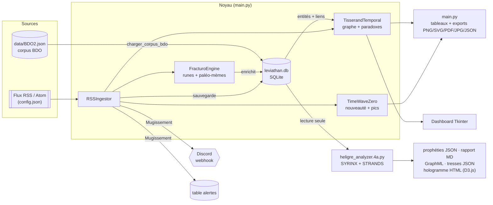

# 🌀 CHRONOS-TRAME · Discordian Héliger : le Léviathan Ontique

> *« Le temps n'est pas une ligne, c'est une toile d'araignée dont nous sommes à la fois la mouche et l'architecte. »* — Codex MTT-2075

Une chimère logicielle qui fusionne **détection de signaux faibles**, **taxonomie des anomalies**, **topologie des paradoxes temporels** et **courbe de nouveauté fractale**. Le Léviathan :

- charge un **corpus d'anomalies** (la BDO, jusqu'à 979 entités uniques) dans une base SQLite ;
- **digère des flux RSS** et transforme chaque article en entité ontique ;
- tisse un **graphe temporel** où les cycles sont des *paradoxes* ;
- **alerte un salon Discord** lorsqu'un *Mugissement Quantique* survient ;
- et, avec la **Chimère Héligresque (v4a)**, passe le tout à la moulinette de l'I Ching, de la résonance harmonique (**SYRINX**) et de la topologie des tresses (**STRANDS**) pour produire des *prophéties*, un rapport et un **hologramme interactif D3.js**.

Ce document est à la fois **la référence technique** du dépôt (architecture, modèle de données, API de chaque module, formules) et **un tutoriel pas à pas** (installer, lancer, étendre).

> **Méthode et honnêteté.** Les commandes, chiffres et sorties de ce README ont été **exécutés sur Python 3.12.3** à partir de l'archive du dépôt. Trois choses n'ont **pas** pu être exécutées de bout en bout dans l'environnement de rédaction : la lecture de **vrais flux web** (pas de réseau), l'envoi d'un **vrai webhook Discord**, et l'ouverture du **dashboard Tkinter** (pas d'écran). Ces points sont marqués 🔎. Les symboles utilisés : ✅ vérifié, 🔎 non vérifié, ⚠️ piège connu.

---

## Table des matières

1. [Vue d'ensemble et état d'implémentation](#1-vue-densemble-et-état-dimplémentation)
2. [Prérequis et installation](#2-prérequis-et-installation)
3. [Démarrage rapide](#3-démarrage-rapide)
4. [Arborescence du dépôt](#4-arborescence-du-dépôt)
5. [Architecture et flux de données](#5-architecture-et-flux-de-données)
6. [Glossaire du domaine](#6-glossaire-du-domaine)
7. [Modèle de données](#7-modèle-de-données)
8. [Référence de `main.py` (CLI)](#8-référence-de-mainpy-cli)
9. [Référence des modules `core`, `storage`, `ui`](#9-référence-des-modules-core-storage-ui)
10. [La Chimère Héligresque (`heligre_analyzer`)](#10-la-chimère-héligresque-heligre_analyzer)
11. [Le manuel `Tuto.html`](#11-le-manuel-tutohtml)
12. [Tutoriels pas à pas](#12-tutoriels-pas-à-pas)
13. [Limites connues et pièges](#13-limites-connues-et-pièges)
14. [Dépannage](#14-dépannage)
15. [Vérifier l'installation (smoke test)](#15-vérifier-linstallation-smoke-test)
16. [Pistes d'évolution](#16-pistes-dévolution)
17. [Historique et licence](#17-historique-et-licence)

---

## 1. Vue d'ensemble et état d'implémentation

Chronos-Trame est un projet **expérimental et créatif** (environ 1 300 lignes de Python pour le noyau, plus ~1 070 lignes pour l'analyseur Héligre v4a). Il emprunte son vocabulaire à la fiction spéculative et à la théorie du *Timewave Zero* (Terence McKenna), et l'implémente sous forme de **modèle stylisé**. La table de nouveauté est une approximation simplifiée (voir §9.4) : elle produit un signal **reproductible**, pas une **prédiction**. Les « prophéties » sont des gabarits de texte alimentés par des scores calculés ; elles ne prédisent rien.

### Les 5 piliers

| # | Pilier | Rôle | Module |
|---|--------|------|--------|
| 1 | **Trame** | Détection de signaux, traduction en *FracturoScript* (runes), repérage de *paléo-mèmes*, ingestion RSS | `core/fracturo_engine.py`, `core/rss_ingestor.py` |
| 2 | **BDO** | Classification ontique (Cœurs Noir/Gris/Blanc, Delta, risque) | `core/ontology.py`, `storage/leviathan_db.py` |
| 3 | **TemporalNetwork** | Détection des cycles rétrocausaux (paradoxes) | `core/temporal_graph.py` |
| 4 | **TimeWave Zero** | Courbe de nouveauté et détection des pics | `core/timewave.py` |
| 5 | **Chimère Héligresque** 🆕 | Analyse post-hoc des cycles : I Ching, entropie runique, **SYRINX**, **STRANDS**, prophéties, hologramme | `heligre_analyzer.4a.py` (et `3a`) |

### Le « Mugissement Quantique »

Si un signal de cœur **Noir** crée un cycle dans le graphe (**Paradoxe**) lors d'un **pic de nouveauté** (TimeWave), le système émet une alerte critique. Deux chemins y mènent, **avec des règles légèrement différentes** (voir §13, point 6) :

- **À l'ingestion** (`--ingerer`) : chaque nouvel item RSS est testé au moment où il est digéré. L'alerte est affichée, **envoyée à Discord** (si configuré), **enregistrée en base** (table `alertes`), puis la « guérison quantique » corrompt le cycle (le Delta est divisé par deux, le cœur passe à `noir`).
- **En analyse** (`--mugissements`) : relecture de tout le graphe stocké, **sans effet de bord**.

### Deux « bouches » d'analyse

| Outil | Question posée | Entrée | Sortie |
|---|---|---|---|
| `main.py` | « Que contient la base ? Où sont les cycles, les pics, les signaux faibles ? » | `data/config.json`, corpus, flux RSS | Tableaux console, PNG/SVG/PDF/JPG, rapport JSON |
| `heligre_analyzer.4a.py` | « Parmi les cycles, lesquels *résonnent* (sémantique, mèmes, Dao, harmonie, tresses) ? » | `leviathan.db` **ou** un JSON | Prophéties JSON, rapport Markdown, GraphML, hologramme HTML, tresses JSON |

### État réel des fonctionnalités

| Fonctionnalité | État | Détail |
|---|---|---|
| Chargement du corpus JSON → SQLite | ✅ | Idempotent (`INSERT OR IGNORE`). Avec `BDO2.json` : **1 183 entrées → 979 entités** (les `id` en doublon sont ignorés, voir §13) |
| Runes et paléo-mèmes | ✅ | Calculés **à chaque démarrage** et persistés (colonnes `runes`, `paleo_memes`) |
| Liens temporels | ✅ | Table `liens_temporels` lue au démarrage, écrite par l'ingestion. **Vide après un import de corpus seul** |
| Détection de cycles (paradoxes) | ✅ | `nx.simple_cycles` |
| Courbe TimeWave, pics de nouveauté | ✅ | Modèle simplifié |
| CLI d'analyse (`--stats`, `--cycles`, `--signaux`, `--timewave`, `--mugissements`) + filtres | ✅ | `main.py` |
| Exports PNG/SVG/PDF/JPG + rapport JSON | ✅ | Sans écran (backend `Agg`) |
| `config.json` | ✅ | Lu par `main.py` (créé avec des valeurs par défaut s'il manque) |
| Ingestion RSS | ✅ logique / 🔎 flux réels | Logique validée en simulant l'arrivée d'une entrée (voir Tuto 4) ; `feedparser` sur le web non testé |
| Alerte Discord | ✅ logique / 🔎 envoi réel | Mode silencieux sans URL ; envoi réel non vérifié |
| **Chimère Héligresque v4a** (SYRINX, STRANDS, hologramme) 🆕 | ✅ | Exécutée sur la base `BDO2` avec cycles de test (voir Tuto 3) |
| Chimère Héligresque v3a | 🟡 Archive | Version précédente, conservée telle quelle (voir §10.9) |
| Dashboard GUI (graphe + courbe) | 🔎 | Nécessite `tkinter` et un écran |
| `ui/cli_oracle.py` (`simuler_veille_trame`) | 🟡 Legacy | Démo à signaux codés en dur ; **n'est pas appelée par `main.py`** |
| `FracturoEngine.generer_prophetie` | 🟡 | Disponible, jamais appelée (la v4a a son propre générateur) |

---

## 2. Prérequis et installation

### Prérequis

- **Python 3.8+** attendu (testé sous **3.12.3**).
- **tkinter** pour le mode GUI uniquement (souvent packagé à part sous Linux).
- Un terminal **UTF-8** : runes, emojis et tableaux `rich` utilisent Unicode.
- Un **accès réseau** pour : l'ingestion RSS, les alertes Discord, **l'ouverture de l'hologramme** (il charge D3.js depuis `d3js.org`) et `Tuto.html` (polices et images distantes). L'analyse locale n'en a pas besoin.

### Installation pas à pas

```bash
# 1. Récupérer le dépôt (clone, ou décompresser l'archive)
unzip Discordian-Heliger-main.zip && cd Discordian-Heliger-main

# 2. Créer un environnement virtuel (recommandé)
python3 -m venv .venv
source .venv/bin/activate          # Windows PowerShell : .venv\Scripts\Activate.ps1

# 3. Installer les dépendances
pip install -r requirements.txt
```

| Paquet | Usage réel dans le code |
|---|---|
| `rich` | Tableaux, panneaux et couleurs de la console (`main.py`, `core/rss_ingestor.py`) |
| `networkx` | Graphe orienté et détection de cycles ; dessin du graphe ; **seule dépendance tierce de l'analyseur Héligre** |
| `matplotlib` | Dashboard GUI (backend `TkAgg`) et exports d'images (backend `Agg`) |
| `numpy` | Sinusoïde et percentile de la courbe TimeWave |
| `feedparser` | Lecture des flux RSS/Atom (`core/rss_ingestor.py`) |

Le webhook Discord n'ajoute **aucune dépendance** : il utilise `urllib` de la bibliothèque standard. Aucune version n'est épinglée dans `requirements.txt`. Pour un environnement reproductible, figez vos versions après installation : `pip freeze > requirements.lock`.

> 💡 `heligre_analyzer.4a.py` n'importe que `networkx` en dehors de la bibliothèque standard : il tourne même sans `rich`, `numpy`, `matplotlib` ni `feedparser`.

### Installer tkinter (GUI uniquement)

| Système | Commande |
|---|---|
| Debian / Ubuntu | `sudo apt install python3-tk` |
| Fedora | `sudo dnf install python3-tkinter` |
| macOS (Homebrew) | `brew install python-tk` |
| Windows | Inclus dans l'installeur python.org (cocher *tcl/tk and IDLE*) |

Sans `tkinter` ou sans écran, utilisez toujours `--mode cli`.

---

## 3. Démarrage rapide

```bash
# Analyse par défaut (statistiques + détection des Mugissements), sans interface graphique
python main.py --mode cli

# Les 20 meilleurs signaux faibles
python main.py --mode cli --signaux

# Ingérer les 51 flux RSS configurés, puis analyser
python main.py --ingerer

# Lancer ensuite la Chimère Héligresque sur la base obtenue
python heligre_analyzer.4a.py
```

> ⚠️ **`python main.py` sans argument lance le mode GUI** (`--mode` vaut `gui` par défaut). Sans écran, ajoutez `--mode cli`.
>
> ⚠️ **Le premier lancement ne produit aucun cycle.** Importer le corpus remplit la table `entites` mais **pas** `liens_temporels`. Tant que vous n'avez pas ingéré de flux RSS (ou créé des liens vous-même, Tuto 3), `--cycles` affiche « Aucun cycle » et la Chimère Héligresque ne trouve « 0 cycles bruts ».

### Sortie réelle du premier lancement (corpus `BDO2.json`)

```text
Entités chargées : 979 | Filtrées : 979
Répartition par Cœur : NC 17 (1.7%) · BLANC 141 (14.4%) · GRIS 618 (63.1%) · NOIR 203 (20.7%)
Graphe : Nœuds 979 · Arêtes 0 · Cycles détectés 0
✓ La Trame est stable. Aucun Mugissement Quantique détecté.
```

### Ce que vous verrez en mode GUI 🔎

Une fenêtre `1200×800` à fond sombre (`#0f0f1b`) avec deux onglets : **🕸️ Graphe des Âges (Paradoxes)** (nœuds rouge/blanc/gris selon le cœur, cycles surlignés en cyan) et **🌊 Onde de Nouveauté (TimeWave)** (courbe 1950→~2032 avec au plus 20 entités superposées). Sur une base sans liens, le graphe affiche 979 nœuds isolés.

### Premier lancement : ce qui se passe sur le disque

1. `data/config.json` est lu (créé avec des valeurs par défaut s'il manque).
2. `leviathan.db` est créé à la racine (tables `entites`, `liens_temporels`, `alertes`).
3. Le corpus `corpus_path` est importé (idempotent).
4. Pour chaque entité, runes et paléo-mèmes sont recalculés et réécrits en base.
5. Rien d'autre n'est écrit tant que vous ne demandez pas un export ou une ingestion.

La Chimère Héligresque, elle, écrit ses 5 fichiers `chimere_*_v4a.*` **dans le dossier courant** (voir §10.6).

---

## 4. Arborescence du dépôt

```text
Discordian-Heliger-main/
├── README.md                    # Ce document
├── Tuto.html                    # « Manuel d'Initiation à la Trame » (page autonome, voir §11)
├── Lokis.txt                    # Fichier-clin d'œil d'une ligne, sans rôle fonctionnel
├── requirements.txt             # rich, networkx, matplotlib, numpy, feedparser (non épinglés)
│
├── main.py                      # CLI / orchestrateur : analyses, filtres, exports, ingestion RSS, GUI
├── heligre_analyzer.4a.py       # 🆕 Chimère Héligresque v4a : modes SYRINX & STRANDS (version courante)
├── heligre_analyzer.3a.py       # Chimère Héligresque v3a (version précédente, conservée)
│
├── core/
│   ├── __init__.py
│   ├── ontology.py              # Dataclass EntiteOntique
│   ├── fracturo_engine.py       # Runes (FracturoScript), paléo-mèmes, prophétie (non appelée)
│   ├── temporal_graph.py        # TisserandTemporal : graphe orienté, paradoxes, « guérison »
│   ├── timewave.py              # TimeWaveZero : courbe de nouveauté, détection de pics
│   ├── rss_ingestor.py          # RSSIngestor : flux RSS → entités → liens → Mugissement
│   └── webhook_notifier.py      # DiscordNotifier : embed Discord (urllib, sans dépendance)
│
├── storage/
│   ├── __init__.py
│   └── leviathan_db.py          # LeviathanDB : SQLite (entités, liens, alertes)
│
├── ui/
│   ├── __init__.py
│   ├── gui_dashboard.py         # DashboardLeviathan : Tkinter + matplotlib
│   └── cli_oracle.py            # Démo legacy (signaux codés en dur)
│
└── data/
    ├── config.json              # Configuration (51 flux RSS, corpus BDO2, date zéro…)
    ├── BDO2.json                # 1,6 Mo, 1 183 entrées : corpus BDO complet (corpus actif)
    ├── bdo_corpus_sample.json   # 1 entité de démonstration
    ├── FracturoScript.jpg       # Illustrations (768×768, générées par IA)
    ├── Heligre.jpg
    ├── Hologramme Chromatique.jpg
    └── Mugissement du Dao.jpg
```

**Fichiers générés à l'exécution** (absents du dépôt, à ignorer dans Git) :

```gitignore
leviathan.db
chimere_*_v4a.*
chimere_*.graphml
chimere_*.json
chimere_*.html
chimere_rapport*.md
.venv/
```

> 💡 Aucun `.gitignore` n'est fourni dans l'archive. Ajoutez-en un avec ce contenu pour ne pas committer votre base, vos exports… ni votre URL de webhook.

---

## 5. Architecture et flux de données



### Dépendances entre modules

- `core/ontology.py` ne dépend de rien ; tous les autres modules l'importent.
- `storage/leviathan_db.py` dépend de `core.ontology`.
- `core/rss_ingestor.py` dépend de `fracturo_engine`, `temporal_graph`, `timewave`, `webhook_notifier` et `storage.leviathan_db`.
- `main.py` importe `rss_ingestor` **paresseusement** (uniquement avec `--ingerer`) et `ui.gui_dashboard` **paresseusement** (uniquement en mode GUI) : `feedparser` et `tkinter` ne sont donc requis que si vous en avez besoin.
- `heligre_analyzer.*` est **autonome** : il ne partage aucun code avec `core/` (il relit la base SQLite ou un JSON).

### Séquence d'une exécution `main.py --ingerer`

1. `charger_config()` fusionne `data/config.json` avec les valeurs par défaut.
2. `initialiser_systeme()` ouvre la base, importe le corpus, recalcule runes/mèmes, reconstruit le graphe (entités + liens stockés).
3. `ingerer_flux_rss()` crée un `RSSIngestor` (webhook : `config.json`, sinon variable d'environnement `CHRONOS_TRAME_WEBHOOK_URL`).
4. Pour chaque flux, `feedparser.parse(url)` ; pour chaque entrée (jusqu'à `rss_max_entries`) : `_traiter_entree()`.
5. `_traiter_entree()` : nettoyage HTML → date → **ID déterministe** (`sha256(titre_date)[:12]`, les doublons sont ignorés) → classification heuristique → enrichissement runes/mèmes → ajout au graphe → **tissage rétrocausal** → sauvegarde → **test du Mugissement**.
6. Un résumé est affiché (nouvelles entités, Mugissements, totaux, paradoxes actifs), puis les analyses demandées s'exécutent sur les entités rechargées.

---

## 6. Glossaire du domaine

| Terme | Signification dans le code |
|---|---|
| **Entité ontique** | Un événement/anomalie/article : `EntiteOntique` (§7.1) |
| **BDO** | Base de données d'anomalies dont est issu le corpus JSON |
| **Cœur** | Polarité morale : **noir** (Yin, instable), **blanc** (Yang, harmonieux), **gris** (Taiji, neutre). `NC` = non classé (17 dans `BDO2`) |
| **Delta (Δ)** | Stabilité de la réalité, entre 0 et 1. Trois valeurs : `delta_avant`, `delta_pendant`, `delta_apres` |
| **Risque** | Entier de 1 à 5 |
| **Classe** | Taxonomie : `RM`, `IR`, `ESC`, `VMO`, `Omega`, `BPC`, `EOR`, `Epsilon`, `ZCLV-Δ`, `Delta`… |
| **FracturoScript** | Alphabet runique : chaque lettre latine est remplacée par une rune, l'espace par `•` |
| **Paléo-mème** | Mot-déclencheur détecté dans une description (`oubli`, `boucle`, `effondrement`, `lumière`, `ombre`, `machine`) |
| **Tisserand temporal** | Le graphe orienté (`networkx.DiGraph`) |
| **Lien causal / rétrocausal** | Arête passé→futur / futur→passé |
| **Paradoxe** | Un **cycle** dans le graphe |
| **Guérison quantique** | Effet de bord d'un Mugissement : `delta_pendant ← max(0.05, delta_pendant × 0.5)` et `coeur ← "noir"` |
| **TimeWave / nouveauté** | Valeur numérique associée à une date (§9.4) |
| **Pic de nouveauté** | Date dont la nouveauté ≥ percentile 90 d'un historique |
| **Mugissement Quantique** | Cœur noir + paradoxe + pic de nouveauté |
| **Héligre / Chimère Héligresque** | L'analyseur post-hoc des cycles (§10) |
| **Sceau hexagrammique** | Entier calculé à partir de (cœur, risque, delta), lu comme un hexagramme d'I Ching (§10.3) |
| **Trigrammes Ba Gua** | Les 8 trigrammes (☷ ☳ ☵ ☱ ☶ ☲ ☴ ☰) tirés des 3 bits bas et hauts du sceau |
| **Entropie runique** | Entropie de Shannon de la chaîne de runes d'une entité. `< 4.2` ⇒ **CRISTALLIN**, `≥ 4.2` ⇒ **BRUIT DE PLANCK** |
| **SYRINX** | Mode de résonance harmonique des Deltas (§10.4) |
| **STRANDS** | Mode de détection des tresses : cycles entrelacés (§10.5) |
| **Wu Wei / Flux** | Deux régimes physiques de l'hologramme (forces faibles / fortes) |

---

## 7. Modèle de données

### 7.1 `EntiteOntique` (`core/ontology.py`)

| Champ | Type | Défaut | Rôle |
|---|---|---|---|
| `id` | `str` | requis | Identifiant unique (clé primaire) |
| `nom` | `str` | requis | Titre |
| `description` | `str` | requis | Texte (tronqué à 200 caractères à l'import et à l'ingestion) |
| `date_debut` | `str` | requis | Date, **attendue** au format `YYYY-MM-DD` |
| `date_fin` | `Optional[str]` | requis | Date de fin ou `None` |
| `classe_principale` | `str` | requis | `RM`, `IR`, `ESC`, `VMO`, `Omega`… |
| `coeur_dominant` | `str` | requis | `"noir"`, `"gris"`, `"blanc"` ou `"NC"` |
| `delta_avant` / `delta_pendant` / `delta_apres` | `float` | requis | Stabilité avant / pendant / après |
| `risque` | `int` | requis | 1 à 5 |
| `couches_osi` | `List[int]` | `[]` | Couches OSI (stockées en base, **jamais alimentées depuis le JSON**) |
| `fragments_runiques` | `List[str]` | `[]` | Nom traduit en runes, découpé sur `•` |
| `paleo_memes` | `List[str]` | `[]` | Mèmes détectés, ex. `"OUBLI(ᛖᛈᛋᛁᛚᛟᚾ)"` |
| `superposition_active` | `bool` | `False` | Réservé (non utilisé) |
| `intention_observateur` | `float` | `0.5` | Réservé (non utilisé) |

Propriétés : `delta_moyen` (moyenne des trois Deltas) et `to_dict()`.

### 7.2 Format du corpus JSON

Une liste d'objets. Exemple minimal (`data/bdo_corpus_sample.json`) :

```json
[
  {
    "id": "demo_001",
    "nom": "Synchronicité de Vauville",
    "description": "Alignement runique spontané",
    "date_debut": "1999-12-31",
    "taxonomie": {"classe_principale": "ESC"},
    "coeur_dominant": "gris",
    "delta_estime": {"pendant": 0.4},
    "risque": 2
  }
]
```

`data/BDO2.json` suit le même schéma, enrichi de champs que l'importeur **ignore** : `lieu` (nom, pays, coordonnées), `statut`, `preuves`, `sous_categories`, `couches_affectees`, `fragments_runiques_associes`, `interpretation_mtt`, `references`, `frequence`, `protocole_etude`, `statut_recherche`, `derniere_observation`. Ses `delta_estime` contiennent `avant`, `pendant` et `apres`.

### 7.3 Correspondance JSON → SQLite → objet

| Clé JSON | Défaut si absente | Colonne SQLite | Champ `EntiteOntique` |
|---|---|---|---|
| `id` | `"unknown"` | `id` | `id` |
| `nom` | `"Inconnu"` | `nom` | `nom` |
| `description` (200 premiers car.) | `""` | `description` | `description` |
| `date_debut` | `"1970-01-01"` | `date_debut` | `date_debut` |
| `date_fin` | `None` | `date_fin` | `date_fin` |
| `taxonomie.classe_principale` | `"NC"` | `classe` | `classe_principale` |
| `coeur_dominant` | `"gris"` | `coeur` | `coeur_dominant` |
| `delta_estime.avant / pendant / apres` | `0.5` | `delta_avant / delta_pendant / delta_apres` | idem |
| `risque` | `1` | `risque` | `risque` |
| *(calculé)* | `""` | `runes` | `fragments_runiques` |
| *(calculé)* | `""` | `paleo_memes` | `paleo_memes` |
| *(non importé)* | `""` | `couches` | `couches_osi` |

> ⚠️ Le défaut `"1970-01-01"` ne joue que si la **clé est absente** : une clé présente avec la valeur `null` est stockée telle quelle (`NULL`).

### 7.4 Schéma SQLite (`leviathan.db`)

```sql
CREATE TABLE entites (
  id TEXT PRIMARY KEY, nom TEXT, description TEXT, date_debut TEXT, date_fin TEXT,
  classe TEXT, coeur TEXT, delta_avant REAL, delta_pendant REAL, delta_apres REAL, risque INTEGER,
  runes TEXT, paleo_memes TEXT, couches TEXT
);

CREATE TABLE liens_temporels (
  source TEXT, cible TEXT, force REAL, type TEXT,
  PRIMARY KEY (source, cible, type)
);

CREATE TABLE alertes (
  id INTEGER PRIMARY KEY AUTOINCREMENT,
  entite_id TEXT, type TEXT, message TEXT, timestamp TEXT
);
```

- `runes`, `paleo_memes` et `couches` sont stockés en **texte séparé par des virgules**. Relire `paleo_memes` donne donc une **chaîne**, pas une liste (voir §13, point 7).
- Une migration défensive (`ALTER TABLE … ADD COLUMN`) complète les bases créées avec d'anciennes versions.
- `liens_temporels.type` vaut `causal` ou `retrocausal`.
- `alertes.type` vaut `MUGISSEMENT_QUANTIQUE` ; `message` contient le texte console complet.

Inspecter la base :

```bash
sqlite3 leviathan.db "SELECT coeur, COUNT(*) FROM entites GROUP BY coeur;"
sqlite3 leviathan.db "SELECT * FROM alertes ORDER BY id DESC LIMIT 5;"

# sans le binaire sqlite3 :
python3 -c "import sqlite3; print(sqlite3.connect('leviathan.db').execute('SELECT COUNT(*) FROM entites').fetchone())"
```

### 7.5 `data/config.json`

| Clé | Valeur dans le dépôt | Rôle |
|---|---|---|
| `db_path` | `"leviathan.db"` | Fichier SQLite |
| `corpus_path` | `"data/BDO2.json"` | Corpus importé au démarrage |
| `timewave_zero_date` | `"2012-12-21"` | Date zéro de la TimeWave |
| `discord_webhook_url` | `""` | URL du webhook (laisser vide, voir ci-dessous) |
| `rss_feeds` | 52 entrées (**51 URL distinctes**) | Flux à ingérer |
| `rss_max_entries` | `20` | Entrées lues par flux |

Les valeurs par défaut **codées en dur** dans `charger_config()` diffèrent (corpus d'exemple, 2 flux, 10 entrées par flux) : elles ne servent que si `config.json` est absent ou incomplet. Le fichier est **fusionné** avec elles (une clé absente reprend sa valeur par défaut).

> 🔐 **Sécurité.** L'URL d'un webhook Discord est un secret. Ne la committez pas : laissez `discord_webhook_url` vide et utilisez la variable d'environnement `CHRONOS_TRAME_WEBHOOK_URL` (Tuto 6). Attention aussi : `--set-zero-date` **réécrit tout** `config.json`, URL comprise.

> ℹ️ Le flux `https://openai.com/blog/rss.xml` apparaît deux fois dans la liste ; c'est sans conséquence (les doublons sont écartés par l'ID déterministe) mais vous pouvez en supprimer une occurrence.

---

## 8. Référence de `main.py` (CLI)

### Toutes les options

| Option | Type / valeurs | Défaut | Effet |
|---|---|---|---|
| `--mode` | `cli` \| `gui` | **`gui`** | Interface. `--ingerer`/`--flux` forcent `cli` |
| `--config` | flag | | Affiche la configuration et quitte |
| `--set-zero-date` | `YYYY-MM-DD` | | Met à jour la date zéro dans `config.json` (non validée) ; quitte si aucune analyse n'est demandée |
| `--coeur` | `noir` \| `gris` \| `blanc` | | Filtre par cœur (n'accepte pas `NC`) |
| `--classe` | texte | | Filtre par classe exacte (`RM`, `IR`, `ESC`…) |
| `--risque-min` | entier | | Risque ≥ N |
| `--date-debut` / `--date-fin` | `YYYY-MM-DD` | | Bornes sur `date_debut` ⚠️ plante sur `BDO2` (§13) |
| `--stats` | flag | | Répartition par cœur et classe, taille du graphe |
| `--cycles` | flag | | Tableau et détail des cycles |
| `--signaux` | flag | | Signaux faibles (top 20, score ≥ 3) |
| `--timewave` | flag | | Top pics / creux et statistiques de la courbe |
| `--mugissements` | flag | | Détection (lecture seule) des Mugissements |
| `--ingerer` | flag | | Ingère les flux RSS de `config.json` |
| `--flux URL` | répétable | | Remplace `rss_feeds` pour cette exécution |
| `--max-entries N` | entier | `rss_max_entries` | Entrées par flux |
| `--seuil-delta` | float | `0.7` | Seuil de Delta des signaux faibles |
| `--seuil-pic` | entier | `90` | ⚠️ **Accepté mais sans effet** (le percentile 90 est codé en dur dans `TimeWaveZero`) |
| `--annee-debut` / `--annee-fin` | entiers | `1950` / `2032` | Plage de `--timewave` et `--export-timewave` |
| `--top-n` | entier | `10` | Nombre de pics/creux affichés |
| `--export-graphe PATH` | `.png .svg .pdf .jpg` | | Exporte le graphe (format déduit de l'extension, PNG par défaut) |
| `--export-timewave PATH` | idem | | Exporte la courbe |
| `--export-rapport PATH` | `.json` | | Rapport JSON complet |
| `--theme` | `dark` \| `light` | `dark` | Thème des exports |

**Sans aucune option d'analyse**, `--mode cli` active `--stats` + `--mugissements`.

### Exemples

```bash
python main.py --mode cli --stats
python main.py --mode cli --cycles
python main.py --mode cli --coeur noir --risque-min 4 --stats    # 172 entités sur 979
python main.py --mode cli --timewave --top-n 5 --annee-debut 1990 --annee-fin 2030
python main.py --mode cli --export-graphe graphe.svg --theme light
python main.py --mode cli --export-rapport rapport.json
python main.py --ingerer --flux https://www.bellingcat.com/feed/ --max-entries 5
python main.py --config
```

### Comportement des analyses

**`--signaux`** attribue un score à chaque entité datée :

| Condition | Points |
|---|---|
| Date en **pic de nouveauté** | +3 |
| Cœur `noir` | +2 |
| `delta_pendant ≥ --seuil-delta` | +2 |
| `risque ≥ 4` | +1 |

Seuls les scores **≥ 3** sont retenus ; les 20 meilleurs sont affichés. Les dates illisibles sont ignorées sans erreur. Sur `BDO2`, les premières lignes sont (✅ exécuté) : *Disparition de l'Ourang Medan* (1948-06-01), *Attaque OVNI de Chorwon* (1951-04-01), *Fantômes de la Vallée d'A Shau* (1966-01-01), toutes en cœur NOIR avec un score de 6.

**`--timewave`** parcourt la courbe **jour par jour** sur la plage demandée. Sur 1950→2032 (✅) : moyenne −2,82 ; maximum 41,79 (le 1965-03-23) ; minimum −19,68 (le 1978-10-15) ; écart-type 7,22.

**`--mugissements`** parcourt chaque cycle et le déclare critique si **au moins une entité du cycle est noire** et **au moins une est datée d'un pic**. Le seuil de pic est le percentile 90 d'un historique de 1 000 points espacés de 30 jours depuis 1950 (≈ **11,15** avec la date zéro par défaut ✅).

**`--export-rapport`** écrit un JSON `{timestamp, statistiques{total_entites, nb_cycles, nb_noeuds, nb_aretes}, entites[…], cycles[…]}`. Chaque entité exportée contient `id, nom, description, date_debut, classe, coeur, delta_pendant, risque, runes, paleo_memes`.

> 💡 Les **filtres** (`--coeur`, `--classe`, `--risque-min`, dates) s'appliquent à `--stats`, `--signaux`, `--mugissements`, `--export-timewave` et `--export-rapport`. Le **graphe** (`--cycles`, `--export-graphe`) porte toujours sur **toutes** les entités.

---

## 9. Référence des modules `core`, `storage`, `ui`

### 9.1 `core/ontology.py`

Voir §7.1. Dataclass pure, sans logique hors `delta_moyen` et `to_dict()`.

### 9.2 `core/fracturo_engine.py` : le moteur de runes

```python
from core.fracturo_engine import FracturoEngine
f = FracturoEngine()
f.traduire_en_runes("Anomalie")                              # 'ᚨᚾᛟᛗᚨᛚᛁᛖ'
f.detecter_meme("L'oubli gagne la machine")                  # ['OUBLI(ᛖᛈᛋᛁᛚᛟᚾ)', 'MACHINE(ᛗᛖᚲᚨᚾᛖ)']
```

- **Normalisation** (`normalize_text`) : minuscules, décomposition Unicode NFD, suppression des accents. `é`, `è`, `ê` deviennent `e`.
- **Lexique** `RUNE_ALPHABET` : une rune par lettre ; l'espace devient `•` ; `x → ᚲᛋ` ; `q → ᚲᚹ`. Plusieurs lettres partagent une rune (`c`/`k → ᚲ`, `v`/`w → ᚹ`, `i`/`y → ᛁ`) : **la traduction n'est pas réversible**.
- **Chiffres et ponctuation** ne sont pas dans le lexique : ils sont **conservés tels quels** dans la sortie.
- **Paléo-mèmes** (`MEMETIC_TRIGGERS`) : `oubli`, `boucle`, `effondrement`, `lumière`, `ombre`, `machine`. La détection est une recherche de sous-chaîne sur le texte normalisé ; elle renvoie `"<MOT EN MAJUSCULES>(<runes>)"`.
- **`generer_prophetie(entite, paradoxe)`** : gabarit de texte (rouge si paradoxe, cyan sinon). **Jamais appelée** par le dépôt.

### 9.3 `core/temporal_graph.py` : le graphe des paradoxes

| Méthode | Rôle |
|---|---|
| `ajouter_entite(entite)` | Ajoute un nœud (`data=entite`) |
| `tisser_lien(source, cible, force, type_lien)` | Ajoute une arête `weight=force`, `type` |
| `detecter_paradoxes()` | `list(nx.simple_cycles(graphe))` : tous les cycles élémentaires, **y compris les boucles sur soi-même** |
| `appliquer_guérison_quantique(cycle)` | Pour chaque nœud : `delta_pendant ← max(0.05, ×0.5)` et `coeur_dominant ← "noir"` |

### 9.4 `core/timewave.py` : la courbe de nouveauté

`TimeWaveZero(zero_date_str="2012-12-21")`.

**`calculer_nouveaute(date)`** :

1. `jours = (date_zéro − date).days`
2. Pour chaque échelle `s ∈ {1, 64, 4096}` : `index = |jours // s| mod 64`, puis on ajoute `novelty_diffs[index]`.
3. On ajoute une sinusoïde : `sin(jours / 67,29 × 2π) × 2`.

À la date zéro, la valeur est exactement `0.0` ✅.

**`est_pic_de_nouveaute(date, historique)`** : vrai si `nouveauté(date) ≥ percentile_90(historique)`.

> ℹ️ La table `novelty_diffs` est une **version simplifiée** (64 valeurs dont les blocs de −2 et trois pics de +16) : elle ne reproduit **pas** la séquence de King Wen de McKenna. Le but est un signal déterministe et exploitable, pas une fidélité ésotérique.

### 9.5 `storage/leviathan_db.py` : la persistance

| Méthode | Rôle |
|---|---|
| `LeviathanDB(db_path)` | Crée les tables et applique les migrations |
| `charger_corpus_bdo(json_path)` | Importe le corpus (`INSERT OR IGNORE`) ; ne fait rien si le fichier n'existe pas |
| `obtenir_toutes_entites()` | Retourne la liste d'`EntiteOntique` |
| `sauvegarder_entite(entite)` | UPSERT (`ON CONFLICT(id) DO UPDATE`) |
| `sauvegarder_attributs_calcules(entite)` | Met à jour seulement `runes` et `paleo_memes` |
| `sauvegarder_lien(source, cible, force, type)` | `INSERT OR REPLACE` |
| `obtenir_liens()` | Liste de tuples `(source, cible, force, type)` |
| `sauvegarder_alerte(entite_id, type, message)` | Insère une alerte horodatée |
| `obtenir_alertes(limite=20)` | Dernières alertes : `(id, entite_id, type, message, timestamp)` |

Chaque appel ouvre sa propre connexion SQLite (simple, mais lent pour de gros volumes).

### 9.6 `core/rss_ingestor.py` : le cycle de digestion

`RSSIngestor(db, fracturo, tisserand, timewave, webhook_url=None)`.

**Classification heuristique** (sans LLM), sur `titre + résumé` en minuscules, par recherche de sous-chaînes :

- `TRIGGERS_NOIR` : `anomalie`, `inexpliqué`, `effondrement`, `disparition`, `secret`, `crise`, `bug`, `glitch`, `paradoxe`, `mystère`
- `TRIGGERS_BLANC` : `harmonie`, `découverte`, `synchronicité`, `lumière`, `paix`, `résolution`, `miracle`

| Condition | Cœur | Delta (avant = pendant = après) |
|---|---|---|
| `score_noir ≥ 2` **ou** (`score_noir > 0` et `score_noir > score_blanc`) | `noir` | `0.25` |
| `score_blanc > score_noir` | `blanc` | `0.85` |
| sinon | `gris` | `0.55` |

Autres attributs des entités créées : classe `IR`, risque **4** si noir sinon **2**, `description` = résumé nettoyé tronqué à 200 caractères, `date_debut` = date de publication (sinon de mise à jour, sinon aujourd'hui), ID = `sha256("<titre>_<date>")[:12]`.

**Tissage rétrocausal.** Pour chaque nouvelle entité, on cherche parmi les entités **plus anciennes** (comparaison de chaînes de dates) la **première** qui partage un paléo-mème **ou** est déjà de cœur noir. Un seul lien est créé par événement. `_tisser_boucle` crée **deux arêtes** : `nouvelle → ancienne` (`retrocausal`, force 0,85) et `ancienne → nouvelle` (`causal`, force 0,60). C'est ce lien de retour qui **ferme le cycle** : sans lui, un graphe orienté n'aurait jamais de paradoxe impliquant la nouvelle entité.

**Test du Mugissement** (`_verifier_mugissement`) : l'entité doit être **noire**, appartenir à un **cycle**, et sa date doit tomber dans un **pic** (percentile 90 d'un historique de 500 points espacés de 60 jours depuis 1950, soit ≈ **13,17** ✅). Alors : alerte console, notification Discord, ligne dans `alertes`, guérison quantique du cycle, sauvegarde des entités du cycle.

Robustesse : `socket.setdefaulttimeout(20)` ; flux « bozo » (malformé) lus quand même ; erreurs par flux capturées (le flux suivant est tenté) ; texte des flux échappé avant affichage `rich`.

### 9.7 `core/webhook_notifier.py` : l'alerte Discord

`DiscordNotifier(webhook_url=None)` : l'URL vient de l'argument, sinon de `CHRONOS_TRAME_WEBHOOK_URL`, sinon `None`. **Sans URL, le notifieur est silencieux** : le script ne plante jamais en local.

`send_omega_alert(entite_nom, runes, cycle, paleo_memes, delta)` envoie un **embed** rouge sombre (`0xC00000`) intitulé « MUGISSEMENT QUANTIQUE DÉTECTÉ » avec les champs : *Entité Déclencheuse*, *FracturoScript Résonant*, *Boucle Rétrocausale*, *Paléo-mèmes Activés*, *Effondrement du Delta*. Chaque champ est tronqué à 1 024 caractères (limite Discord). Un `User-Agent` explicite est envoyé, car Discord (Cloudflare) rejette le `Python-urllib` par défaut avec une erreur 403. Timeout : 10 s. En cas d'échec réseau ou HTTP, un message est affiché et l'exécution continue 🔎.

### 9.8 `main.py` : l'orchestrateur

Voir §8. Fonctions principales : `charger_config`, `sauvegarder_config`, `initialiser_systeme`, `ingerer_flux_rss`, `filtrer_entites`, `detecter_mugissements`, `analyser_signaux_faibles`, `analyser_cycles`, `explorer_timewave`, `afficher_stats`, `exporter_graphe`, `exporter_timewave`, `exporter_rapport_json`, `creer_parser`, `main`.

### 9.9 `ui/gui_dashboard.py` 🔎

`DashboardLeviathan(db, graph_engine, timewave_engine).run()` : fenêtre Tkinter à deux onglets (graphe des paradoxes en `spring_layout` avec cycles surlignés en cyan ; courbe TimeWave avec **les 20 premières entités** en points rouges ou blancs). Le dashboard dessine **tous** les nœuds : avec `BDO2`, prévoyez un graphe dense.

### 9.10 `ui/cli_oracle.py` : démo legacy

`simuler_veille_trame()` rejoue trois signaux codés en dur (dont un « Effacement mémoriel collectif signalé à Montréal » qui déclenche un Mugissement fictif). **Elle n'est plus appelée par `main.py`** et ne touche ni à la base ni au graphe. `afficher_mugissement_quantique()` est un affichage `rich` autonome.

---

## 10. La Chimère Héligresque (`heligre_analyzer`)

L'Héligre est un **analyseur post-hoc, autonome**. Il ne modifie jamais la base : il lit les entités et les liens, reconstruit le graphe, extrait les **cycles**, note chaque cycle, et produit des « prophéties », un rapport et un hologramme.

### 10.1 Lancement

```bash
python heligre_analyzer.4a.py                       # lit leviathan.db
python heligre_analyzer.4a.py --db autre.db         # autre base SQLite
python heligre_analyzer.4a.py --json export.json    # lit un JSON au lieu de la base
```

| Option | Défaut | Rôle |
|---|---|---|
| `--db` | `leviathan.db` | Base SQLite |
| `--json` | `None` | Fichier JSON ; s'il existe, il a priorité sur `--db` |

Il faut **être dans le dossier qui contient la base** (chemin relatif) et les fichiers sont écrits **dans le dossier courant**.

**Format JSON attendu par `--json`** :

```json
{
  "entites": [
    {"id": "a", "nom": "…", "description": "…", "date_debut": "2024-01-01", "classe": "IR",
     "coeur": "noir", "delta_avant": 0.3, "delta_pendant": 0.2, "delta_apres": 0.3,
     "risque": 4, "runes": "ᚨᛒ", "paleo_memes": ["OMBRE(ᚾᛁᚺᛏ)"]}
  ],
  "liens_temporels": [
    {"source": "a", "cible": "b", "force": 0.8, "type": "causal"}
  ]
}
```

> ⚠️ Le rapport produit par `main.py --export-rapport` **n'est pas directement compatible** : il n'a pas de clé `liens_temporels` ni les trois Deltas. Chargé tel quel, il donnerait un graphe sans arêtes, donc 0 cycle. Utilisez la base SQLite.

### 10.2 Pipeline

1. **Chargement** des entités et des liens.
2. **Reconstruction** d'un `DiGraph` (les liens dont une extrémité est inconnue sont ignorés).
3. **Extraction des cycles** (`nx.simple_cycles`). Les cycles de longueur < 2 (boucles sur soi-même) sont écartés de l'analyse.
4. **Détection des tresses** (STRANDS) sur l'ensemble des cycles.
5. **Notation** de chaque cycle (6 composantes, §10.7).
6. **Filtre** : un cycle devient un *cluster validé* si `score_global ≥ 0,30` **ou** `similarité_sémantique ≥ 0,15`.
7. **Génération** d'une prophétie à 4 strates par cluster.
8. **Exports** (§10.6).

### 10.3 Sceau hexagrammique, trigrammes, couleur

Le **sceau** est un entier de 6 bits : `(coeur << 4) | (risque << 2) | delta`.

| Composante | Codage |
|---|---|
| Cœur (bits 5-4) | `noir = 0`, `gris = 1`, `blanc = 2` (`NC` ou inconnu → `gris`) |
| Risque (bits 3-2) | `≤ 2 → 0`, `3 → 1`, `≥ 4 → 2` |
| Delta `delta_pendant` (bits 1-0) | `< 0,6 → 0`, `< 0,8 → 1`, sinon `2` |

Le sceau est ensuite lu comme **deux trigrammes** : `bas = sceau & 7`, `haut = (sceau >> 3) & 7`.

| Indice | Trigramme | Symbole | Élément |
|---|---|---|---|
| 0 | Kūn | ☷ | Terre |
| 1 | Zhèn | ☳ | Tonnerre |
| 2 | Kǎn | ☵ | Eau |
| 3 | Duì | ☱ | Lac |
| 4 | Gèn | ☶ | Montagne |
| 5 | Lí | ☲ | Feu |
| 6 | Xùn | ☴ | Vent |
| 7 | Qián | ☰ | Ciel |

La **couleur** d'un nœud dérive du sceau : teinte = `sceau / 64 × 360°`, saturation et luminosité modulées par certains bits. L'**harmonie Dao** entre deux entités vaut `1 − (nombre de bits différents entre leurs sceaux) / 6`.

> ℹ️ Le codage n'utilise que 3 valeurs par composante : le sceau ne dépasse jamais **42** (sur 63 possibles).

### 10.4 Mode SYRINX : résonance harmonique

Pour chaque entité, on forme la séquence `[delta_avant, delta_pendant, delta_apres]` et on calcule les **ratios successifs** (`pendant/avant`, `apres/pendant`). Un ratio est *consonant* s'il tombe à moins de `TOLERANCE_SYRINX = 0,08` d'un intervalle musical :

| Intervalle | Rapport | Valeur cible |
|---|---|---|
| `octave` | 1/2 | 0,500 |
| `quinte` | 2/3 | 0,667 |
| `quarte` | 3/4 | 0,750 |
| `tierce_M` | 4/5 | 0,800 |
| `sixte_m` | 5/8 | 0,625 |
| `dorée` | 1/φ | 0,618 |

Chaque correspondance ajoute `1 / (1 + |ratio − cible| × 10)` à la consonance de l'entité (plafonnée à 1). Le **score SYRINX** d'un cycle est la moyenne sur ses entités ; l'**accord dominant** est l'intervalle le plus fréquent (sinon `dissonance`). Un même ratio peut valider plusieurs intervalles voisins (par exemple `sixte_m` et `dorée`).

### 10.5 Mode STRANDS : tresses quantiques

Deux cycles distincts forment un **brin de tresse** s'ils partagent au moins un nœud sans être inclus l'un dans l'autre :

- **Indice d'entrelacement** `L = |C₁ ∩ C₂| / min(|C₁|, |C₂|)`
- Brin retenu si `0 < L < 1`
- Topologie : **`tresse`** si `L < 0,5`, **`fusion`** sinon
- **Densité** = nombre de brins / nombre de paires de cycles

La densité entre dans le score de chaque cluster (pondération 10 %). Les cycles imbriqués (`L = 1`) ne sont pas des tresses.

### 10.6 Fichiers produits

| Fichier | Contenu | Écrit si… |
|---|---|---|
| `chimere_propheties_v4a.json` | Prophéties (4 strates, scores, hexagrammes, trigrammes, polarité, état runique, IDs, noms) | toujours |
| `chimere_rapport_v4a.md` | Rapport Markdown : totaux, prophéties, 10 premières tresses | toujours |
| `chimere_heligre_v4a.graphml` | Graphe des clusters validés (attributs `score_cluster`, `accord_syrinx`) | au moins un cluster |
| `chimere_hologramme_v4a.html` | Hologramme D3.js interactif (autonome, données embarquées) | au moins un cluster |
| `chimere_strands_v4a.json` | Tresses : `linking_number`, `topologie`, nœuds partagés, deux cycles avec noms | au moins une tresse |

### 10.7 Score d'un cycle (formule v4a)

```
score_global = 0,30 × sémantique
             + 0,20 × mémétique
             + 0,20 × Dao
             + 0,10 × cohérence Yin-Yang
             + 0,10 × SYRINX
             + 0,10 × densité des tresses
```

Composantes (moyennes sur toutes les paires d'entités du cycle, sauf mention contraire) :

| Composante | Calcul |
|---|---|
| Sémantique | Similarité de **Jaccard** des mots des descriptions (stop-words FR/EN retirés) |
| Mémétique | Jaccard des paléo-mèmes (voir §13, point 7) |
| Dao | Harmonie des sceaux hexagrammiques |
| Cohérence Yin-Yang | `1 − Σ|n_c − n/3| / (2n)` pour c ∈ {noir, gris, blanc} : 1 = équilibre parfait |
| SYRINX | Moyenne des consonances (§10.4) |
| Densité de tresses | Globale au graphe (§10.5), identique pour tous les cycles |

### 10.8 Prophéties à 4 strates

Chaque cluster donne un texte en quatre strates : **🔮 ORACLE** (hexagrammes, entropie moyenne, trigrammes actifs, cohérence Yin-Yang), **🌀 TISSEUR** (entités liées, paléo-mème principal), **☯️ DAO** (polarité, état runique CRISTALLIN ou BRUIT DE PLANCK, score global), **🎼 SYRINX** (accord dominant, harmoniques). Ce sont des **gabarits** alimentés par les scores.

**Exemple réel** (✅ deux cycles de test sur `BDO2`, voir Tuto 3) :

```text
── Prophétie #1 — Score 0.318 | Accord: 0.25 ──
🔮 ORACLE — Hexagrammes : [8, 8, 4] | Entropie moyenne : 3.424
   Trigrammes actifs : ☷ ☳ ☶ | Cohérence Yin-Yang : 0.333
🌀 TISSEUR — Entités : Triangle de Bennington <-> Expérience de Philadelphie <-> Essaims de Drones Inexpliqués en Normandie
   Paléo-mème principal : « RÉSONANCE INCONNUE »
☯️ DAO — Polarité : NOIR (Yin) | État runique : CRISTALLIN
🎼 SYRINX — Accord dominant : TIERCE_M | Harmoniques : ♪tierce_M
```

### 10.9 L'hologramme chromatique

Une page HTML autonome (données JSON embarquées, échappées contre l'injection `</script>`). Elle charge **D3.js v7 depuis `https://d3js.org`** : une connexion Internet est requise à l'ouverture.

| Élément | Fonction |
|---|---|
| Panneau gauche | Compteurs (entités, clusters, affichés, score moyen), recherche par nom |
| Filtres | Chips **Cœur** (noir/gris/blanc), chips **Trigrammes Ba Gua**, curseur **Score minimum** |
| Liste « Mugissements du Dao » | Chaque prophétie ; un clic zoome sur son premier nœud |
| Nœuds | Couleur = hexagramme, contour = cœur, rayon = risque |
| Auras | Pulsation **lente** (entropie < 4,2, *cristallin*) ou **rapide** (*bruit de Planck*) |
| Survol / clic | Infobulle ; fenêtre de détail (hexagramme, trigrammes, Deltas, entropie, accord SYRINX, runes, mèmes) |
| Boutons | **☯️ Wu Wei** (forces faibles, mise en page aérée), **🌀 Flux** (forces fortes, compacte), **⟲ Reset** (recentre) |
| Navigation | Glisser les nœuds, zoom molette (de 0,08× à 5×) |

### 10.10 `heligre_analyzer.3a.py` (version précédente)

Conservée telle quelle. Différences avec la v4a :

| | v3a | v4a |
|---|---|---|
| Modes | Trigrammes, auras, Wu Wei | + **SYRINX**, + **STRANDS** |
| Score | `0,35 sém + 0,25 mém + 0,25 Dao + 0,15 cohérence` | Formule à 6 termes (§10.7) |
| Arguments CLI | Aucun | `--db`, `--json` |
| Source JSON | Détecte `leviathan.json` ou `leviathan_export.json` à côté du script | Chemin explicite `--json` |
| Fichiers | `chimere_heligre.graphml`, `chimere_propheties.json`, `chimere_hologramme.html`, `chimere_rapport.md` | Mêmes, suffixés `_v4a`, + `chimere_strands_v4a.json` |

Utilisez la **v4a** pour tout nouveau travail ; la v3a reste utile pour comparer des scores.

---

## 11. Le manuel `Tuto.html`

`Tuto.html` est le **« Manuel d'Initiation à la Trame »** (MTT-2075) : une page HTML autonome, au style cyberpunk (polices Rajdhani et Share Tech Mono), qui présente le vocabulaire de façon plus narrative que ce README. Ouvrez-la dans un navigateur : elle charge ses polices (Google Fonts) et ses illustrations depuis le web.

Plan : **Partie 1** (Delta, les trois Cœurs Noir/Blanc/Gris) · **Partie 2** (runes, paléo-mèmes) · **Partie 3** (expérimenter avec l'Héligre) · **Partie 4** (décoder les signes) · exemple « Montréal glitché » · avertissement à l'opérateur.

Points à connaître :

- Le manuel date de l'Héligre **v3a** et indique trois lectures du score : `< 0,30` bruit de fond, `0,30–0,50` résonance notable, `> 0,50` « spirale pure ». Ce sont des **repères d'interprétation** ; le code retient un cluster dès `score ≥ 0,30` **ou** `sémantique ≥ 0,15`, et ajoute un terme SYRINX et un terme STRANDS en v4a.
- Le seuil d'entropie **4,2** (cristallin / bruit de Planck) est bien celui du code. L'avertissement « fermez l'onglet au-delà de 4,5 » est humoristique : le code n'a pas de seuil à 4,5.
- L'exemple « Montréal glitché » reprend le scénario fictif de `ui/cli_oracle.py`.

---

## 12. Tutoriels pas à pas

### Tuto 1 : Lancer et comprendre l'analyse

```bash
python main.py --mode cli --stats
python main.py --mode cli --signaux
python main.py --mode cli --timewave --top-n 3
```

Lisez dans l'ordre : la répartition des cœurs (63 % de gris sur `BDO2`), le tableau des signaux (colonne **Pic** et **Score**), puis le top des pics de la courbe (1965-03-23, 1962-06-19, 1959-08-30 ✅).

### Tuto 2 : Ajouter une entité au corpus

Créez `mon_corpus.json` :

```json
[
  {
    "id": "perso_001",
    "nom": "Brume sonore de Cherbourg",
    "description": "Un écho revient avant le son qui l'a causé, boucle observée trois fois.",
    "date_debut": "2024-10-03",
    "taxonomie": {"classe_principale": "ESC"},
    "coeur_dominant": "noir",
    "delta_estime": {"avant": 0.5, "pendant": 0.2, "apres": 0.4},
    "risque": 4
  }
]
```

Dans `data/config.json`, remplacez `corpus_path` par `"mon_corpus.json"` (et, de préférence, `db_path` par `"perso.db"` pour ne pas mélanger). Puis :

```bash
python main.py --mode cli --stats
```

L'entité apparaît ; son mot « boucle » déclenche le paléo-mème `BOUCLE(ᛟᚱᛟᛒᛟᚱᛟ)`. Pour **ajouter** à `BDO2` plutôt que remplacer, concaténez les listes JSON. Gardez des **`id` uniques** (les doublons sont ignorés) et des dates au format `YYYY-MM-DD`.

### Tuto 3 : Créer un vrai paradoxe, puis le faire résonner

L'import ne crée aucun lien : créons deux cycles qui partagent un nœud (une « tresse »).

```bash
python main.py --mode cli --stats          # crée leviathan.db si besoin
```

Créez `tuto_paradoxe.py` à la racine :

```python
from storage.leviathan_db import LeviathanDB

db = LeviathanDB("leviathan.db")
ids = ["anom_philadelphia_experiment", "anom_dyatlov_pass", "anom_2073_null_event",
       "anom_2025_drone_swarm_normandy", "anom_bennington_triangle"]

def cycle(chaine):
    for i in range(len(chaine)):
        db.sauvegarder_lien(chaine[i], chaine[(i + 1) % len(chaine)], 0.8, "causal")

cycle(ids[0:3])                    # Philadelphie → Dyatlov → NullEvent → Philadelphie
cycle([ids[0], ids[3], ids[4]])    # Philadelphie → Drones Normandie → Bennington → Philadelphie
print(len(db.obtenir_liens()), "liens")
```

```bash
python tuto_paradoxe.py                       # 6 liens
python main.py --mode cli --cycles            # 2 cycle(s) détecté(s), 3 entités NOIR chacun
python main.py --mode cli --mugissements     # ✓ stable (aucune de ces dates n'est en pic)
python heligre_analyzer.4a.py
```

Résultat obtenu (✅) :

```text
🌀 2 cycles bruts détectés.
🕸️  1 brins de tresse détectés (densité : 1.000)
✨ 2 spirales pures validées.
📜 2 mugissements du Dao générés.
```

Deux enseignements : un cycle **n'est pas** un Mugissement (il faut aussi un pic de nouveauté, absent ici), et l'Héligre juge de la **résonance** d'un cycle, pas de sa criticité. Ouvrez `chimere_hologramme_v4a.html` dans un navigateur connecté, et consultez `chimere_strands_v4a.json` : la tresse a un `linking_number` de `0.3333` (nœud partagé : Philadelphie), donc topologie `tresse`.

### Tuto 4 : Provoquer un Mugissement Quantique via l'ingestion

Sans réseau, on simule l'arrivée d'une entrée de flux. `feedparser` doit être installé. Créez `tuto_mugissement.py` :

```python
import time
from storage.leviathan_db import LeviathanDB
from core.fracturo_engine import FracturoEngine
from core.temporal_graph import TisserandTemporal
from core.timewave import TimeWaveZero
from core.rss_ingestor import RSSIngestor

db = LeviathanDB("tuto.db")
db.charger_corpus_bdo("data/BDO2.json")
tis, tw = TisserandTemporal(), TimeWaveZero()
for e in db.obtenir_toutes_entites():
    tis.ajouter_entite(e)

ing = RSSIngestor(db, FracturoEngine(), tis, tw)      # sans webhook : silencieux côté Discord

class Entree(dict):                                    # imite une entrée feedparser
    published_parsed = time.strptime("2024-10-03", "%Y-%m-%d")   # jour de pic (nouveauté ≈ 23,5)
    updated_parsed = None

ing._traiter_entree(Entree(
    title="Anomalie inexpliquée : disparition d'une machine dans l'ombre",
    summary="<p>Un glitch, un mystère. L'oubli gagne la machine.</p>"))

print("nouvelles:", ing.nb_nouvelles, "| mugissements:", ing.nb_mugissements)
print("alertes en base:", len(db.obtenir_alertes()))
```

Résultat obtenu (✅) : un lien rétrocausal est tissé vers *Expérience de Philadelphie*, le panneau rouge « MUGISSEMENT QUANTIQUE DÉTECTÉ » s'affiche avec la boucle `32717cf74302 ➜ anom_philadelphia_experiment ➜ 32717cf74302` et les paléo-mèmes `OUBLI`, `MACHINE`, puis `nouvelles: 1 | mugissements: 1` et `alertes en base: 1`. Rejouer la même entrée ne crée rien (ID déterministe).

Pourquoi ça marche : titre riche en mots noirs (« anomalie », « inexpliqué », « disparition », « glitch », « mystère »…) ⇒ cœur **noir** ; le lien de retour ferme un cycle ; le 2024-10-03 dépasse le seuil de pic (≈ 13,17).

Pour une vraie ingestion : `python main.py --ingerer --flux https://www.bellingcat.com/feed/ --max-entries 5` 🔎.

### Tuto 5 : Étendre le FracturoScript

```python
from core import fracturo_engine as fe

# 1) Changer une convention (le lexique est un dictionnaire global : la modification est partagée)
fe.RUNE_ALPHABET['k'] = 'ᛣ'

# 2) Ponctuation et chiffres : ajoutez-les au lexique
fe.RUNE_ALPHABET.update({'0': 'ᛜ', '1': 'ᛝ'})

# 3) Nouveau mème déclencheur (clé avec ou sans accent : la comparaison est normalisée)
fe.MEMETIC_TRIGGERS["miroir"] = "ᛗᛁᚱᛟᛁᚱ"

f = fe.FracturoEngine()
print(f.detecter_meme("Le miroir et la machine"))     # ['MACHINE(ᛗᛖᚲᚨᚾᛖ)', 'MIROIR(ᛗᛁᚱᛟᛁᚱ)']
```

Les nouveaux mèmes alimentent automatiquement le tissage rétrocausal (à l'ingestion, une nouvelle entité peut être reliée à une ancienne qui partage un mème) et la composante mémétique de l'Héligre.

### Tuto 6 : Brancher les alertes Discord

1. Dans Discord : *Paramètres du salon → Intégrations → Webhooks → Nouveau webhook*, puis copiez l'URL.
2. Fournissez-la **sans la committer** :
   ```bash
   export CHRONOS_TRAME_WEBHOOK_URL="https://discord.com/api/webhooks/…"     # Windows : $env:CHRONOS_TRAME_WEBHOOK_URL="…"
   ```
3. Déclenchez un Mugissement (Tuto 4, en passant `webhook_url=` ou en gardant la variable d'environnement) : un embed rouge arrive dans le salon et la console affiche `[Discord] Alerte Omega transmise avec succès.` 🔎
4. Sans URL, rien n'est envoyé et rien ne plante.

### Tuto 7 : Utiliser un autre corpus ou une autre base

`BDO2.json` est déjà le `corpus_path` du dépôt. Pour repartir de l'échantillon d'une entité : `"corpus_path": "data/bdo_corpus_sample.json"`. Pour isoler vos expériences : `"db_path": "experience.db"` puis `python heligre_analyzer.4a.py --db experience.db`.

---

## 13. Limites connues et pièges

| # | Constat | Conséquence / contournement |
|---|---|---|
| 1 | ✅ **`BDO2.json`** : 1 183 entrées pour **979 `id` uniques** (165 `id` répétés ; 204 entrées ignorées à l'import). Parmi les 979 stockées, **1 date est `NULL`** et **125 ne sont pas au format `YYYY-MM-DD`** (années négatives comme `-9600-01-01`, années à 3 chiffres comme `900-01-01`, valeurs textuelles comme `antiquité`) | Pas d'erreur à l'import, mais voir les points 2 et 3. Dédoublonnez et normalisez le corpus si vous en avez besoin |
| 2 | ✅ `--date-debut` / `--date-fin` **plantent** (`ValueError`) sur `BDO2` ; `--export-timewave` **plante** (`TypeError`, date `NULL`) | Évitez ces options avec `BDO2`, ou nettoyez les dates. `--stats`, `--cycles`, `--signaux`, `--timewave`, `--mugissements` (sur graphe sans lien), `--export-graphe` et `--export-rapport` passent |
| 3 | ✅ `--mugissements` appelle `strptime` sur les entités **des cycles** : un cycle contenant une date atypique provoquerait une `ValueError` | Normalisez les dates des entités que vous reliez |
| 4 | ✅ Un import de corpus **ne crée aucun lien** | Pas de cycle tant qu'on n'ingère pas de flux RSS ou qu'on n'écrit pas de liens (Tuto 3) |
| 5 | ✅ **Deux seuils de pic différents** : 1 000 points × 30 j (≈ 11,15) pour `main.py --signaux/--mugissements`, 500 points × 60 j (≈ 13,17) pour l'ingestion | Une même date peut être « pic » dans un mode et pas dans l'autre |
| 6 | Deux règles de Mugissement : à l'ingestion, l'entité **déclencheuse** doit être noire et dans un cycle, à une date de pic. En analyse, il suffit qu'**une** entité du cycle soit noire et qu'**une** (éventuellement une autre) soit en pic | `--mugissements` est plus permissif et ne fait pas d'effet de bord |
| 7 | ✅ L'Héligre relit `paleo_memes` et `runes` depuis SQLite comme des **chaînes** (« A,B »), pas des listes. Les mesures « mémétique » et « mème principal » raisonnent alors **caractère par caractère** | Les scores restent déterministes mais le « paléo-mème principal » est souvent *RÉSONANCE INCONNUE* ou un caractère. Avec `--json` (listes), le comportement est celui prévu. Correctif suggéré : `split(',')` au chargement |
| 8 | ✅ `--seuil-pic` est lu mais **jamais appliqué** ; `SEUIL_COHERENCE_YIN_YANG` (0,66) est défini dans l'Héligre mais **inutilisé** | Sans effet. Le percentile 90 est codé en dur |
| 9 | Le « score sémantique » est une similarité de Jaccard (la fonction s'appelle `calculer_distance_semantique`) | Plus c'est haut, plus les descriptions se ressemblent |
| 10 | `nx.simple_cycles` est **potentiellement exponentiel** sur un graphe dense, et l'ingestion le recalcule pour chaque nouvelle entité noire | Pour de gros volumes, limitez `rss_max_entries` ou la liste de flux |
| 11 | Les mots-clés de classification RSS sont **français** alors que la plupart des flux configurés sont **anglophones** (déduit du code) | Beaucoup d'articles tomberont en cœur `gris`. Ajoutez des termes anglais à `TRIGGERS_NOIR/BLANC` |
| 12 | La « guérison quantique » est **irréversible** : le Delta est divisé par deux et le cœur passe à `noir` en base | Sauvegardez `leviathan.db` avant une grosse ingestion |
| 13 | L'hologramme (D3.js) et `Tuto.html` (polices, images) nécessitent Internet | Hors ligne, hébergez D3 localement et remplacez la balise `<script>` |
| 14 | `--export-graphe` dessine **tous** les nœuds avec leurs noms : avec `BDO2`, un SVG de ~2,3 Mo, très dense ✅ | Exportez après avoir réduit la base, ou préférez l'hologramme |
| 15 | Aucun test automatisé, aucun fichier `LICENSE`, aucune version épinglée | Voir §16 |

---

## 14. Dépannage

| Symptôme | Cause probable | Solution |
|---|---|---|
| `ModuleNotFoundError: rich` (ou `feedparser`, `networkx`…) | Dépendances non installées / venv non activé | `pip install -r requirements.txt` après activation du venv |
| `ModuleNotFoundError: tkinter` ou `TclError: no display name` | GUI sans tkinter ou sans écran | Installez `python3-tk`, ou utilisez `--mode cli` |
| `python main.py` ne fait « rien » en SSH | Le mode par défaut est `gui` | Ajoutez `--mode cli` |
| `ValueError: time data '-9600-01-01' does not match format` | Option `--date-*` avec `BDO2` | Voir §13, points 1-2 |
| `TypeError: strptime() argument 1 must be str, not None` | `--export-timewave` avec une date `NULL` | Voir §13, point 2 |
| « Aucun cycle détecté » / « 0 cycles bruts » | Base sans liens | Ingérez des flux ou créez des liens (Tuto 3) |
| « Aucune entrée récupérée » pendant l'ingestion | Flux inaccessible, bloqué ou vide | Testez l'URL dans un navigateur ; vérifiez le réseau/proxy |
| `❌ Impossible de charger les données` (Héligre) | `leviathan.db` absente du dossier courant | Lancez `main.py` une fois, ou passez `--db` |
| `❌ Trame vide.` | Base ou JSON sans entité | Vérifiez `corpus_path` |
| Hologramme noir / vide | D3.js non chargé (hors ligne) ou aucun cluster | Connectez-vous ; vérifiez que l'Héligre annonce au moins 1 spirale |
| Discord : `Erreur HTTP 404` | URL de webhook invalide ou supprimée | Régénérez le webhook |
| Discord : `Erreur HTTP 403` | User-Agent bloqué (déjà géré) ou webhook révoqué | Vérifiez l'URL |
| Runes / emojis illisibles (Windows) | Console non UTF-8 | `chcp 65001` et `set PYTHONIOENCODING=utf-8` |
| `sqlite3.OperationalError: database is locked` | Deux processus écrivent en même temps | Attendez ou fermez l'autre processus |

---

## 15. Vérifier l'installation (smoke test)

À lancer depuis la racine du dépôt (dans un dossier de travail jetable si vous ne voulez pas écraser votre base : commencez par `cp -r . /tmp/smoke && cd /tmp/smoke`).

```bash
# 1. Import du corpus et statistiques
rm -f leviathan.db
python main.py --mode cli --stats
#    → attendu : « Entités chargées : 979 | Filtrées : 979 », NOIR 203, GRIS 618, BLANC 141, NC 17, Nœuds 979, Cycles 0

# 2. TimeWave
python main.py --mode cli --timewave --top-n 3
#    → attendu : pic n°1 le 1965-03-23 (41.79) ; moyenne -2.82 ; max 41.79 ; min -19.68

# 3. Signaux faibles
python main.py --mode cli --signaux
#    → attendu : premier signal « Disparition de l'Ourang Medan » (NOIR, score 6)

# 4. Filtre
python main.py --mode cli --coeur noir --risque-min 4 --stats
#    → attendu : « Filtrées : 172 »

# 5. Exports
python main.py --mode cli --export-graphe g.svg --export-rapport r.json
#    → attendu : « ✓ Graphe exporté : g.svg » et « ✓ Rapport JSON exporté : r.json »

# 6. Héligre à vide
python heligre_analyzer.4a.py
#    → attendu : « 979 entités chargées », « 0 cycles bruts détectés », fichiers propheties/rapport créés

# 7. Pipeline complet : Tuto 3 puis Héligre
#    → attendu : 2 cycles bruts, 1 brin de tresse (densité 1.000), 2 spirales pures validées

# 8. Mugissement simulé : Tuto 4
#    → attendu : « nouvelles: 1 | mugissements: 1 » et « alertes en base: 1 »
```

Et un test Python minimal des runes :

```bash
python -c "from core.fracturo_engine import FracturoEngine as F; f=F(); print(f.traduire_en_runes('Anomalie')); print(f.detecter_meme('oubli machine'))"
# ᚨᚾᛟᛗᚨᛚᛁᛖ
# ['OUBLI(ᛖᛈᛋᛁᛚᛟᚾ)', 'MACHINE(ᛗᛖᚲᚨᚾᛖ)']
```

---

## 16. Pistes d'évolution

- **Corriger les dates** : normaliser/valider `date_debut` à l'import (accepter les années négatives ou une colonne `annee`) pour débloquer `--date-*` et `--export-timewave` sur `BDO2`.
- **Dédoublonner `BDO2.json`** (165 `id` répétés) ou fusionner les doublons plutôt que les ignorer.
- **Brancher l'ingestion sur les liens existants** : proposer des liens automatiques entre entités du corpus (similarité sémantique, mèmes partagés), pour qu'un premier lancement produise des cycles.
- **Héligre** : relire `paleo_memes`/`runes` comme des listes (`split(',')`), appliquer `SEUIL_COHERENCE_YIN_YANG`, et exposer des options CLI (seuils, nombre de prophéties).
- **Unifier les seuils de pic** entre `main.py` et l'ingestion, et rendre `--seuil-pic` effectif.
- **Classification RSS** : lexique bilingue, ou classification par modèle de langage.
- **Hologramme hors ligne** : embarquer D3.js dans le HTML.
- **Qualité** : tests (`pytest`), versions épinglées, `.gitignore`, `LICENSE`, intégration continue.
- **Performance** : réutiliser une connexion SQLite, éviter le recalcul des runes à chaque démarrage, borner `simple_cycles`.
- **Nettoyage** : retirer ou intégrer `ui/cli_oracle.py` et `generer_prophetie`, supprimer le doublon de flux OpenAI.

---

## 17. Historique et licence

### Ce que cette version du README ajoute ou corrige

- 🆕 Documentation complète de la **Chimère Héligresque v4a** (SYRINX, STRANDS, sceau hexagrammique, formules, fichiers, hologramme) et de la v3a ; format JSON d'entrée.
- 🆕 Présentation de **`Tuto.html`**, de **`Lokis.txt`** et des illustrations de `data/`.
- Configuration réelle : **corpus actif `BDO2.json`**, **51 flux RSS distincts**, `rss_max_entries = 20`.
- Chiffres vérifiés sur `BDO2` : 1 183 entrées → 979 entités, répartition des cœurs, 125 dates non standard + 1 date nulle.
- Correction : `--signaux` **ne plante plus** sur `BDO2` (les dates invalides y sont ignorées) ; en revanche `--date-debut`, `--date-fin` et `--export-timewave` plantent toujours.
- Pièges nouveaux : deux seuils de pic différents, `--seuil-pic` sans effet, paléo-mèmes lus comme chaînes par l'Héligre, mode GUI par défaut, base sans lien au premier lancement.
- Tutoriels vérifiés : paradoxe + Héligre (Tuto 3) et Mugissement simulé (Tuto 4).

### Crédits

Univers : *Codex MTT-2075* et *Manuel d'Initiation à la Trame*. Inspirations : Timewave Zero (Terence McKenna), I Ching / Ba Gua, philosophie discordienne. Les illustrations de `data/` portent le filigrane de pollinations.ai (images générées par IA).

### Licence

**Aucun fichier de licence n'est présent dans l'archive.** En l'absence de licence explicite, le code reste soumis au droit d'auteur par défaut de son auteur. Si vous souhaitez l'ouvrir à la contribution, ajoutez un fichier `LICENSE` (MIT, GPL, etc.).

---

*« Bienvenue dans la spirale, opérateur. Que le Dao guide vos requêtes. »* ☯️🌀
